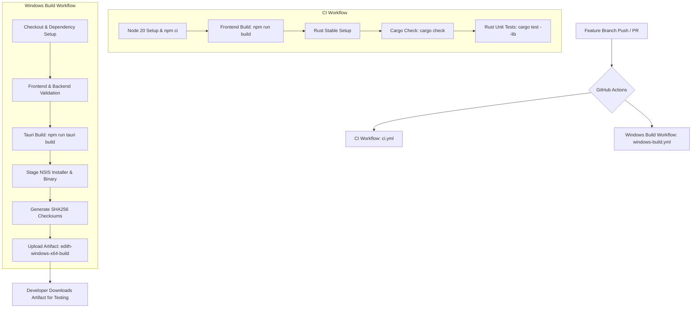

# E.D.I.T.H. — CI/CD Architecture & GitHub Actions Documentation

## 1. CI/CD Architecture Overview

The continuous integration and build pipeline for **E.D.I.T.H.** is built on GitHub Actions, providing automated validation, compilation verification, and Windows desktop installer packaging for every pull request and branch update.



> [!IMPORTANT]
> **Release publishing is intentionally NOT automated yet.**
> Generated artifacts are strictly CI/development build outputs stored in GitHub Actions artifact storage for developer verification and testing. No automated publishing to GitHub Releases or external repositories takes place in this pipeline.

---

## 2. Workflow Files & Structure

The repository contains two dedicated workflows under `.github/workflows/`:

| Workflow File | Purpose | Runner | Output |
| :--- | :--- | :--- | :--- |
| [`.github/workflows/ci.yml`](file:///e:/Projects/E.D.I.T.H/.github/workflows/ci.yml) | Fast development & PR validation | `windows-latest` | Status checks (Pass/Fail) |
| [`.github/workflows/windows-build.yml`](file:///e:/Projects/E.D.I.T.H/.github/workflows/windows-build.yml) | Production Windows package compilation & artifact generation | `windows-latest` | Downloadable ZIP artifact (`edith-windows-x64-build`) |

---

## 3. Triggers & Concurrency

### Triggers
Both workflows are triggered on:
- `push` to branches `main` and `ci/github-actions-setup`
- `pull_request` targeting `main`
- `workflow_dispatch` (Manual on-demand trigger supported on `windows-build.yml`)

### Concurrency Rules
To conserve runner minutes and prevent stale builds from blocking resources, concurrency groups cancel obsolete in-progress runs when new commits are pushed to the same branch or PR:

```yaml
concurrency:
  group: ${{ github.workflow }}-${{ github.ref }}
  cancel-in-progress: true
```

---

## 4. Environment & Toolchain Setup

### Node.js & Frontend Tooling
- **Version**: Node.js `20` (LTS) via `actions/setup-node@v4`.
- **Package Manager**: npm with strict `npm ci` ensuring deterministic installs from `package-lock.json`.
- **Cache**: Built-in npm dependency caching keyed by `package-lock.json`.
- **Frontend Build**: `npm run build` (`tsc && vite build`), compiling TypeScript and bundling assets into `build/`.

### Rust Toolchain & Backend Tooling
- **Toolchain**: `stable` (Rust edition 2021) managed via `dtolnay/rust-toolchain@stable`.
- **Target**: `x86_64-pc-windows-msvc`.
- **Cargo Check**: `cargo check --manifest-path src-tauri/Cargo.toml`.
- **Rust Unit Tests**: `cargo test --manifest-path src-tauri/Cargo.toml --lib`.

### Native Dependencies & Protoc
- **Protoc**: Bundled directly in the repository under `protoc/bin/protoc.exe`. Configured through `.cargo/config.toml` (`PROTOC = "protoc/bin/protoc.exe"`) and `src-tauri/.cargo/config.toml` (`PROTOC = "../protoc/bin/protoc.exe"`). No external protoc downloads are performed.
- **WebView2**: Windows runners provide the Microsoft Edge WebView2 runtime natively.
- **NSIS**: Pre-installed on GitHub-hosted `windows-latest` runner images.

---

## 5. Caching Strategy

The workflows utilize `actions/cache@v4` to cache Cargo registry indexes, download caches, and compiler artifacts:

- **Cached Paths**:
  - `~/.cargo/registry/index/`
  - `~/.cargo/registry/cache/`
  - `~/.cargo/git/db/`
  - `src-tauri/target/`
- **Cache Key Formulation**:
  ```yaml
  key: ${{ runner.os }}-cargo-release-${{ hashFiles('src-tauri/Cargo.lock') }}-${{ hashFiles('src-tauri/Cargo.toml') }}
  restore-keys: |
    ${{ runner.os }}-cargo-release-${{ hashFiles('src-tauri/Cargo.lock') }}-
    ${{ runner.os }}-cargo-release-
  ```
- **Cache Invalidation**: Cache keys automatically invalidate whenever `src-tauri/Cargo.lock` or `src-tauri/Cargo.toml` changes, preventing stale cache corruption.

---

## 6. Testing & Validation Sequence

The build strictly follows a test-before-package sequence:

1. **Checkout**: Clean workspace checkout.
2. **Dependencies**: `npm ci` for frontend.
3. **Frontend Compilation**: `npm run build` validates TypeScript types and Vite bundle integrity.
4. **Rust Compilation Check**: `cargo check` validates Rust syntax and dependency graphs.
5. **Backend Unit Tests**: `cargo test --manifest-path src-tauri/Cargo.toml --lib` executes security and core library test suites.
6. **Packaging**: `npm run tauri build` executes only after all validation steps pass.

> [!NOTE]
> **Frontend Test Suite**: No standalone frontend unit test framework (such as Vitest or Jest) is currently configured in `package.json`. TypeScript typechecking (`tsc`) and Vite bundling serve as frontend validation in this phase.

---

## 7. Artifact Generation & Staging

When `windows-build.yml` runs, it stages only intended release outputs into an isolated `staging/` directory:

```
edith-windows-x64-build/
├── E.D.I.T.H_0.1.0_x64-setup.exe    # NSIS Windows Installer
├── edith-v2.exe                     # Standalone application executable
└── SHA256.txt                       # SHA-256 cryptographic checksums
```

### Checksum Verification
A PowerShell script dynamically generates SHA-256 checksums for all staged `.exe` binaries:
```powershell
Get-FileHash -Algorithm SHA256 -Path staging/*.exe | ForEach-Object { "$($_.Hash)  $($_.Path | Split-Path -Leaf)" } | Set-Content -Path staging/SHA256.txt
```

### Retention Policy
- **Retention Period**: `14 days` (`retention-days: 14`).
- **Rationale**: CI build artifacts are intended for development verification and local testing. 14 days provides ample time for testing without accumulating excessive storage overhead.

---

## 8. Security & Least Privilege

- **Token Permissions**: Workflows run with minimal read-only permissions:
  ```yaml
  permissions:
    contents: read
  ```
- **Zero Secrets Requirement**: The entire CI/CD pipeline builds without requiring any API keys, LLM credentials, certificates, or deployment secrets.
- **No Release Elevation**: No write permissions (`contents: write`, `packages: write`) or deployment environments are granted.

---

## 9. Developer Workflow: Local vs CI Responsibilities

| Action | Local Developer Machine | GitHub Actions Runner |
| :--- | :--- | :--- |
| Code editing & git commits | Yes | No |
| `npm run dev` (Vite UI iteration) | Yes | No |
| `cargo check` (Incremental Rust syntax check) | Yes (Fast: ~3s warm) | Yes (Clean check) |
| `npm run tauri build` (Full release packaging) | **Not required** | **Yes (Handles full packaging)** |
| Installer & binary download | Download from CI run | Generates & hosts artifact |

---

## 10. Future Release Automation Roadmap

When the project reaches the public release phase:
1. A separate `release.yml` workflow will be created, triggered exclusively on annotated version tags (`v*.*.*`).
2. Code signing certificates will be configured via GitHub encrypted repository secrets.
3. Tauri auto-updater manifests (`latest.json`) will be generated.
4. Official releases will publish to GitHub Releases and distribution repositories.
