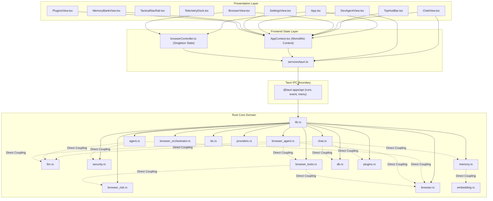
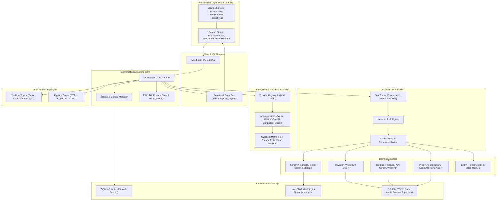
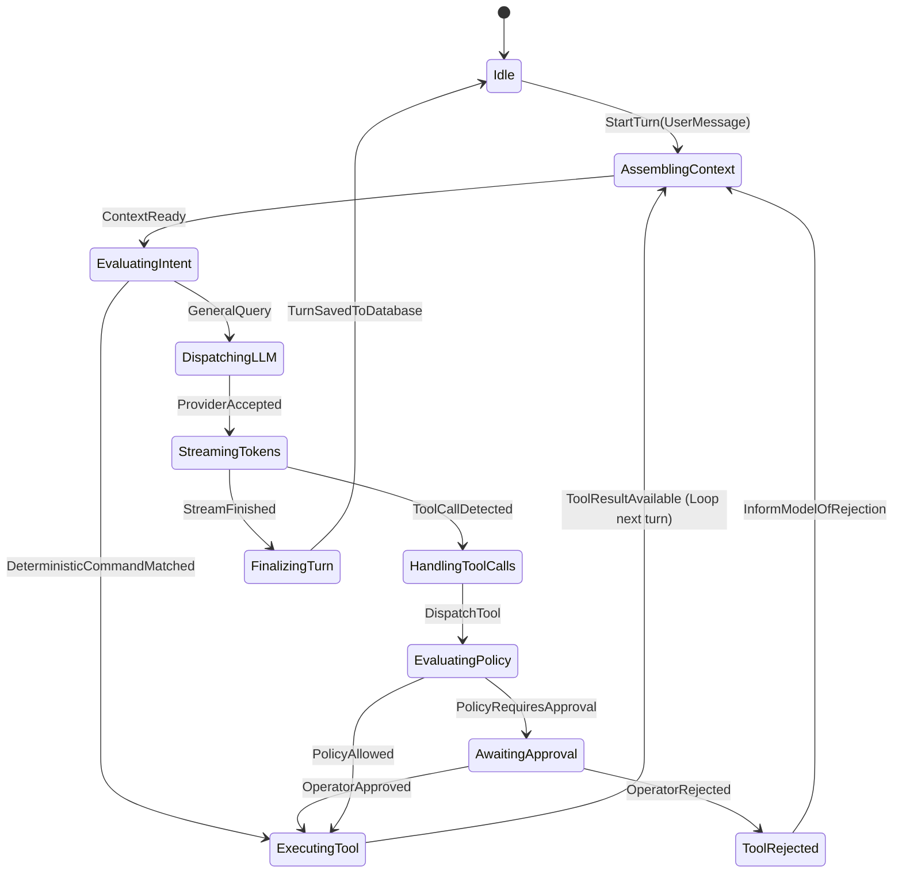
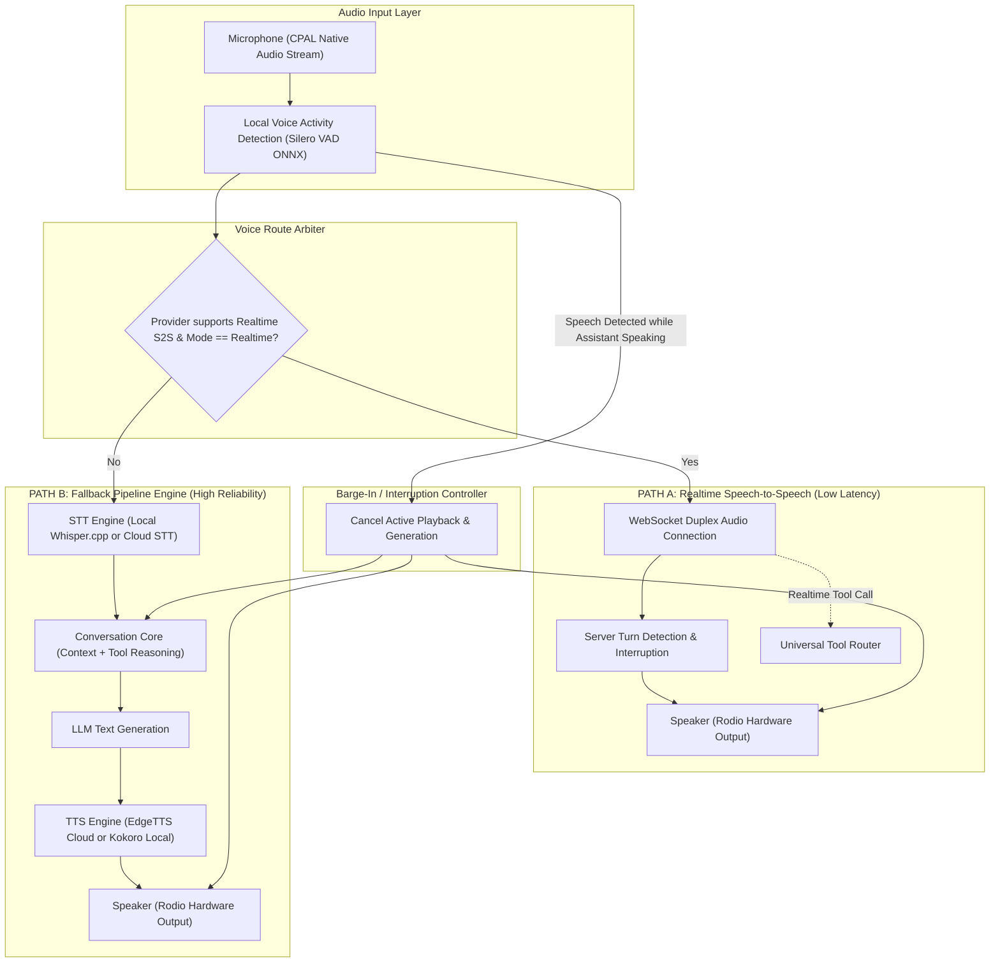
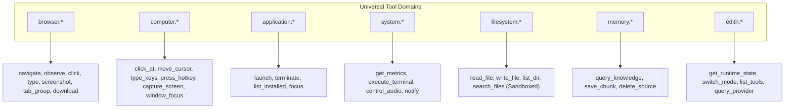
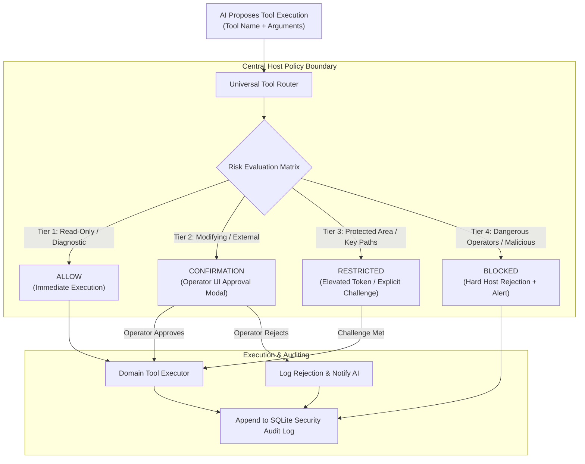
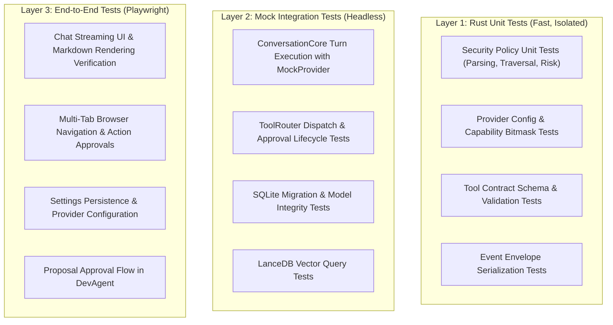

# E.D.I.T.H. AI CORE ARCHITECTURE AUDIT & TARGET ARCHITECTURE SPECIFICATION
**Version:** 1.0.0  
**Status:** STAGE 0 COMPLETED — ARCHITECTURAL AUDIT & TARGET SPECIFICATION  
**Author:** Principal Software Architect (AI Systems & Desktop Infrastructure)  
**Date:** September 2026  
**Repository:** `sumit0879-dev/E.D.I.T.H.` (`e:\Projects\E.D.I.T.H`)  

---

## 1. Executive Summary

E.D.I.T.H. (*Even Dead, I'm The Hero*) is a desktop tactical assistant built on **Tauri 2 (Rust backend)** and **React 18 + Vite + TypeScript (Frontend)**, targeting high-performance desktop productivity, local and cloud LLM execution, deep browser automation, and voice-assisted interactions.

### Current State Assessment
The existing codebase contains working features, notably a multi-tab browser integration with WebView2, an autonomous browser agent with safety risk evaluation, local vector storage via LanceDB, and cloud/local chat infrastructure. However, the system currently suffers from **critical architectural fragmentation**:
1. **Scattered AI Provider Logic:** Provider endpoint resolution, authentication, and model querying are independently re-implemented across `chat.rs`, `browser_agent.rs`, `agent.rs`, `providers.rs`, and frontend services.
2. **Brittle Prompt-Based Tool Invocation:** The AI does not use native function/tool calling contracts. Instead, it relies on parsing raw string tokens (e.g., `[RUN_CMD: ...]`, `[READ_FILE: ...]`, `[BROWSER_TOOL: {...}]`) or hardcoded natural language string prefixes (`open `, `play `, `whatsapp `, `search `).
3. **Fragmented Human-in-the-Loop & Security Engines:** Two completely disjoint risk evaluation and approval systems exist (`security.rs` for terminal/filesystem commands and `browser_risk.rs` for browser actions), with separate in-memory approval storage, separate IPC commands, and inconsistent UI handling.
4. **Decoupled Browser Agent & UI:** A browser agent and multi-tab orchestrator exist in Rust (`browser_agent.rs` and `browser_orchestrator.rs`), but they are completely disconnected from the primary chat UI (`ChatView.tsx`) and browser view (`BrowserView.tsx`).
5. **Asymmetric Voice Pipeline:** Voice is split between browser Web Speech API (STT in frontend) and Azure EdgeTTS / Rodio in Rust (TTS in backend), with audio playing twice (via Rodio device sink and frontend HTML5 audio) and zero support for streaming duplex speech-to-speech.
6. **Monolithic State & Uncoordinated Events:** `AppContext.tsx` concentrates UI navigation, settings, audio refs, session persistence, and plugin states into a single context, while global Tauri events (such as `chat-chunk`) lack correlation IDs, leading to stream collisions.

### Target Vision
This document delivers the architectural blueprint for the **E.D.I.T.H. Unified AI Core Runtime (v1.0)**. It establishes:
- A **Provider Abstraction Layer** with dynamic capability discovery (Text, Streaming, Vision, Tools, STT, TTS, Realtime S2S, Embeddings).
- A centralized **Conversation Core** owning session state, context accumulation, cancellation, and execution pipelines.
- A **Universal Tool Runtime** unifying `browser.*`, `computer.*`, `application.*`, `system.*`, `filesystem.*`, and `memory.*` under a single schema and execution engine.
- A centralized **Host-Enforced Security & Risk Engine** with deterministic policy checks, audit logging, and unified approval queues.
- A **Dual-Path Voice Engine** supporting both Realtime Streaming Speech-to-Speech (low latency, server VAD, barge-in) and an STT → Conversation Core → TTS Fallback Pipeline.
- A **Zero-Breakage 10-Phase Migration Strategy** preserving all working browser automation, custom provider integrations, and existing database models.

---

## 2. Current Architecture

### 2.1 Technology Stack & Physical Footprint
- **Desktop Runtime:** Tauri v2.0.0 (`tauri`, `tauri-plugin-shell`, `tauri-plugin-fs`, `tauri-plugin-dialog`, `tauri-plugin-opener`).
- **Backend Language:** Rust (2021 edition), Tokio async runtime (`tokio 1.37`), Reqwest (`reqwest 0.12` with json and streaming), Rusqlite (`rusqlite 0.31.0`), Rodio (`rodio 0.22.2`), Edge-TTS (`edge-tts-rust 0.1.3`), LanceDB (`lancedb 0.14`), Arrow (`arrow 53.0`), Screenshots (`screenshots 0.8.10`).
- **Frontend Framework:** React 18.3.1, TypeScript 5.7.3, Vite 6.1.0, Tailwind CSS 3.4.17, Lucide Icons, React-Markdown, Remark-GFM.
- **Persistence Layer:**
  - Relational Database: SQLite via `rusqlite` stored at `%APPDATA%/edith_memory.db`.
  - Vector Storage: LanceDB embedded vector table stored at `%APPDATA%/lancedb`.
  - Client Cache: `localStorage` fallbacks in `src/services/tauri.ts`.

### 2.2 Current System Component Structure

```mermaid
graph TD
    subgraph Frontend ["Frontend (React 18 + Vite + TypeScript)"]
        UI_Main["App.tsx (Main Layout)"]
        HUD["TopHudBar.tsx & TacticalNavRail.tsx"]
        Views["Views: ChatView, BrowserView, DevAgentView, MemoryBankView, PluginsView, SettingsView"]
        Context["AppContext.tsx (Monolithic Context)"]
        Services["Services: tauri.ts, browserController.ts"]
    end

    subgraph IPC ["Tauri 2 IPC Boundary"]
        Commands["80+ #[tauri::command] Endpoints"]
        Events["Global Events: chat-chunk, tool-proposal, model-progress"]
    end

    subgraph Backend ["Rust Backend (src-tauri/src)"]
        Lib["lib.rs (App Builder & State Initialization)"]
        ChatEngine["chat.rs (Command Matching & Orchestration)"]
        LLMEngine["llm.rs (Reqwest SSE Streaming & llama-server Subprocess)"]
        ProvidersMod["providers.rs (Provider Catalog & Model Fetching)"]
        DevAgent["agent.rs (Dev Agent Loop & String Tool Parsing)"]
        BrowserCore["browser.rs (Native Webview2 Child Windows)"]
        BrowserTools["browser_tools.rs (20+ Browser Tool Definitions & Dispatch)"]
        BrowserAgent["browser_agent.rs & browser_orchestrator.rs (Autonomous Task Loops)"]
        RiskEngines["Security: security.rs (Commands) vs browser_risk.rs (Browser)"]
        VoiceEngine["tts.rs (EdgeTTS Cloud + Rodio Audio Sink)"]
        MemoryEngine["memory.rs (LanceDB) + embedding.rs (Char Trigram Hashing)"]
        DBEngine["db.rs (SQLite Tables: Sessions, Messages, Settings, Browser Records)"]
        OSPlugins["plugins.rs, screen.rs, windows.rs, weather.rs"]
    end

    Frontend --> IPC
    IPC --> Backend
```



### 2.3 Detailed Subsystem Inventory

| Subsystem | Primary Code Location | Key Responsibilities & Capabilities |
| :--- | :--- | :--- |
| **Frontend Root & Navigation** | [`src/App.tsx`](file:///e:/Projects/E.D.I.T.H/src/App.tsx) | 3-column layout (Rail, Viewport, Telemetry Dock); view switching; browser visibility hooks. |
| **Application Context** | [`src/context/AppContext.tsx`](file:///e:/Projects/E.D.I.T.H/src/context/AppContext.tsx) | Manages tabs, settings, sessions, providers, plugins, toasts, Web Speech API recording, TTS playback state. |
| **Chat View** | [`src/views/ChatView.tsx`](file:///e:/Projects/E.D.I.T.H/src/views/ChatView.tsx) | Renders messages, listens to `chat-chunk` for streaming, dispatches `chatCommand`, saves messages. |
| **Dev Agent View** | [`src/views/DevAgentView.tsx`](file:///e:/Projects/E.D.I.T.H/src/views/DevAgentView.tsx) | Workspace context loader, proposal resolution UI, tool-proposal event listener. |
| **Browser View & Controller** | [`src/views/BrowserView.tsx`](file:///e:/Projects/E.D.I.T.H/src/views/BrowserView.tsx), [`src/services/browserController.ts`](file:///e:/Projects/E.D.I.T.H/src/services/browserController.ts) | Multi-tab omnibox, tab groups, history, bookmarks, downloads, reader mode, WebView2 coordination. |
| **Tauri Service Bridge** | [`src/services/tauri.ts`](file:///e:/Projects/E.D.I.T.H/src/services/tauri.ts) | Typed TypeScript bindings for 80+ Tauri IPC commands, with localStorage browser mocks. |
| **Backend Entrypoint** | [`src-tauri/src/lib.rs`](file:///e:/Projects/E.D.I.T.H/src-tauri/src/lib.rs) | Initializes Tauri plugins, manages `DbState`, `AgentState`, `BrowserState`, registers commands. |
| **Chat Routing & Dispatch** | [`src-tauri/src/chat.rs`](file:///e:/Projects/E.D.I.T.H/src-tauri/src/chat.rs) | Prefix string intent matching (`open`, `play`, `cmd`), LanceDB RAG retrieval, LLM call, auto-memory saving. |
| **LLM Gateway & Streaming** | [`src-tauri/src/llm.rs`](file:///e:/Projects/E.D.I.T.H/src-tauri/src/llm.rs) | HTTP POST with `stream: true`, Server-Sent Events parser, `chat-chunk` emitter, `llama-server.exe` process supervisor. |
| **Provider Directory** | [`src-tauri/src/providers.rs`](file:///e:/Projects/E.D.I.T.H/src-tauri/src/providers.rs) | Hardcoded Groq/Gemini definitions, dynamic `/models` endpoint scraper. |
| **Browser Runtime Core** | [`src-tauri/src/browser.rs`](file:///e:/Projects/E.D.I.T.H/src-tauri/src/browser.rs) | Native Webview2 child window lifecycle, DOM injection script, screenshot capture, navigation. |
| **Browser Tools** | [`src-tauri/src/browser_tools.rs`](file:///e:/Projects/E.D.I.T.H/src-tauri/src/browser_tools.rs) | 20+ tool definitions (observation, click, type, wait, download, profiles, tab groups). |
| **Browser Agent & Orchestration**| [`src-tauri/src/browser_agent.rs`](file:///e:/Projects/E.D.I.T.H/src-tauri/src/browser_agent.rs), [`src-tauri/src/browser_orchestrator.rs`](file:///e:/Projects/E.D.I.T.H/src-tauri/src/browser_orchestrator.rs) | Autonomous ReAct loops, bracket JSON extractor, evidence verification engine, cancellation tokens. |
| **Browser Risk Engine** | [`src-tauri/src/browser_risk.rs`](file:///e:/Projects/E.D.I.T.H/src-tauri/src/browser_risk.rs) | In-memory pending approvals, policy codes, navigation scheme checks, credential masking. |
| **Security & Command Policy** | [`src-tauri/src/security.rs`](file:///e:/Projects/E.D.I.T.H/src-tauri/src/security.rs) | Shell tokenization, dangerous character validation, path sandboxing, command proposal queue. |
| **Vector Memory** | [`src-tauri/src/memory.rs`](file:///e:/Projects/E.D.I.T.H/src-tauri/src/memory.rs), [`src-tauri/src/embedding.rs`](file:///e:/Projects/E.D.I.T.H/src-tauri/src/embedding.rs) | LanceDB table management, 384-dim vector generator using character n-gram hashing and FNV hash. |
| **Relational Storage** | [`src-tauri/src/db.rs`](file:///e:/Projects/E.D.I.T.H/src-tauri/src/db.rs) | SQLite schema initialization, sessions, messages, settings, notes, custom apps, browser metadata. |
| **Text-to-Speech** | [`src-tauri/src/tts.rs`](file:///e:/Projects/E.D.I.T.H/src-tauri/src/tts.rs) | Edge-TTS synthesis, Rodio background audio thread, Base64 audio return, commented-out Kokoro ONNX engine. |

---

## 3. Current Data Flows

### A. Text Conversation Data Flow (Actual Implementation)

```mermaid
sequenceDiagram
    autonumber
    actor User
    participant View as ChatView.tsx
    participant Service as services/tauri.ts
    participant RustChat as chat.rs (chat_command)
    participant Memory as memory.rs (LanceDB)
    participant LLM as llm.rs (api_chat_cloud)
    participant Provider as External AI API (Groq/Gemini)
    participant DB as db.rs (SQLite)

    User->>View: Enters text prompt and hits Send
    View->>View: Appends optimistic user Message & empty assistant Message (isStreaming=true)
    View->>Service: saveSessionMessage(sessionId, 'user', text)
    Service->>DB: INSERT INTO messages (role='user', text=...)
    View->>Service: chatCommand(text, sessionId, history, settings)
    Service->>RustChat: invoke('chat_command', {message, sessionId, history, settings})
    
    rect rgb(20, 30, 40)
        Note over RustChat: 1. Prefix Intent Matching (open, play, cmd, etc.)
        Note over RustChat: 2. If 'search': Tavily fetch; else LanceDB vector search
    end
    
    RustChat->>Memory: search_memory_cmd(query)
    Memory-->>RustChat: Vec<MemoryChunk> (top 5 cosine matches)
    RustChat->>RustChat: Construct system prompt (custom instructions + user info + memory chunks)
    RustChat->>RustChat: resolve_provider_config (maps 'groq'/'gemini'/customProvider JSON)
    RustChat->>LLM: api_chat_cloud(apiKey, url, ChatRequest, emit_event="chat-chunk")
    LLM->>Provider: HTTP POST /chat/completions (stream=true)
    
    loop Server-Sent Events (SSE) Stream
        Provider-->>LLM: data: {"choices":[{"delta":{"content":"..."}}]}
        LLM->>View: app.emit("chat-chunk", content)
        View->>View: Appends token to active streaming message
    end
    
    LLM-->>RustChat: Returns full accumulated String
    RustChat->>Memory: tokio::spawn -> save_to_memory_cmd(turn, "chat:{sessionId}")
    RustChat-->>Service: Ok(ChatResponse { response, type: "ai" })
    Service-->>View: Returns response
    View->>View: Sets isStreaming=false on assistant Message
    View->>Service: saveSessionMessage(sessionId, 'assistant', fullResponse)
    Service->>DB: INSERT INTO messages (role='assistant', text=...)
    
    opt settings.autoSpeak == 'true'
        View->>Service: speakText(fullResponse)
    end
```

### B. Voice Data Flow (Actual Implementation)

```mermaid
sequenceDiagram
    autonumber
    actor User
    participant Bar as FloatingCommandBar.tsx
    participant Context as AppContext.tsx (Web Speech API)
    participant Chat as ChatView.tsx
    participant TauriService as services/tauri.ts
    participant RustTTS as tts.rs
    participant RodioSink as Windows Audio Device (Rodio)
    participant HTMLAudio as Browser Audio Element (DOM)

    User->>Bar: Clicks Mic button
    Bar->>Context: toggleRecording()
    Context->>Context: Creates webkitSpeechRecognition (lang='en-US', continuous=false)
    User->>Context: Speaks into microphone
    Context->>Context: recog.onresult receives event.results[0][0].transcript
    Context->>Bar: onTranscript callback updates text input
    User->>Chat: Triggers handleSendMessage(transcript)
    Note over Chat: Standard Text Conversation Flow executes...
    Chat->>Context: speakText(assistantResponse)
    
    Context->>TauriService: ttsSpeak(text, voice="hi-IN-SwaraNeural")
    TauriService->>RustTTS: invoke('tts_speak', { text, voice })
    RustTTS->>RustTTS: Regex strips markdown chars: [*`_~#]
    RustTTS->>RustTTS: EdgeTtsClient::new().synthesize(clean_text)
    
    par Parallel Audio Output Anomaly
        RustTTS->>RodioSink: AUDIO_SENDER.send(PlayEncodedBytes) -> Plays through hardware sink
    and
        RustTTS-->>TauriService: Returns Base64-encoded MP3 string
        TauriService->>HTMLAudio: new Audio("data:audio/mp3;base64,...").play()
    end
```

### C. Browser Agent Execution Flow (Actual Implementation)

```mermaid
sequenceDiagram
    autonumber
    actor User
    participant View as DevAgentView.tsx / qa_test
    participant RustAgent as browser_agent.rs (run_autonomous_browser_loop)
    participant Webview2 as browser.rs (Child WebView)
    participant Risk as browser_risk.rs (BrowserRiskEngine)
    participant Tools as browser_tools.rs (execute_browser_tool)
    participant LLM as llm.rs (api_chat_cloud)

    User->>View: Submits goal: "Search flight tickets on example.com"
    View->>RustAgent: invoke('browser_agent_run_task', { goal, max_steps: 20 })
    RustAgent->>RustAgent: Validates single active task; registers AtomicBool cancel flag
    
    loop Step Loop (until completed, max_steps, or cancelled)
        RustAgent->>Webview2: browser_observe_tab(current_tab_id, "full_page")
        Webview2->>Webview2: Executes injected JS DOM crawler; returns PageObservationSnapshot
        RustAgent->>RustAgent: Builds prompt with snapshot, URL, interactive element IDs
        RustAgent->>LLM: api_chat_cloud(prompt)
        LLM-->>RustAgent: Text containing: [BROWSER_TOOL: {"name": "browser_click", "args": {"tab_id": "tab_a", "element_id": "id_12"}}]
        RustAgent->>RustAgent: extract_single_browser_tool_call() using bracket-depth counter
        RustAgent->>RustAgent: validate_browser_tool_call() parameter validation
        
        RustAgent->>Tools: execute_browser_tool(app, "browser_click", args)
        Tools->>Risk: BrowserRiskEngine::assess_risk(risk_ctx)
        
        alt Decision == Block
            Risk-->>Tools: Decision::Block
            Tools-->>RustAgent: Error: Blocked by security policy
        else Decision == RequireApproval
            Risk->>Risk: Store PendingBrowserActionApproval in Mutex
            Risk-->>Tools: Decision::RequireApproval
            Tools-->>RustAgent: Approval required (emits approval event to UI)
        else Decision == Allow
            Tools->>Webview2: browser_click_element(tab_id, element_id)
            Webview2-->>Tools: BrowserActionResult { success: true }
            Tools-->>RustAgent: BrowserToolExecutionResult
        end
        
        RustAgent->>RustAgent: verify_completion_evidence() verifies against false success
    end
```

### D. Provider Selection & Request Flow (Actual Implementation)

```mermaid
flowchart TD
    subgraph UI_Selection ["Frontend Configuration"]
        SettingsView["SettingsView.tsx"]
        TopHudBar["TopHudBar.tsx"]
        SettingsView -->|updateSetting| AppContext["AppContext.tsx"]
        TopHudBar -->|updateSetting| AppContext
        AppContext -->|invoke('save_setting')| DB_Settings["SQLite settings table"]
    end

    subgraph Chat_Dispatch ["chat.rs Execution"]
        ChatCommand["chat.rs:chat_command"]
        DB_Settings -->|read settings| ChatCommand
        ChatCommand --> ResolveProv["resolve_provider_config()"]
        
        ResolveProv -->|provider == 'gemini'| GemCfg["URL: generativelanguage.googleapis.com<br/>Key: apiKey_gemini"]
        ResolveProv -->|provider == 'groq'| GroqCfg["URL: api.groq.com<br/>Key: apiKey_groq"]
        ResolveProv -->|customProviders JSON| CustCfg["Parse JSON array -> match ID -> url + apiKey"]
        ResolveProv -->|fallback| FallCfg["URL: api.groq.com<br/>Key: apiKey_{provider}"]
    end

    subgraph LLM_Exec ["llm.rs Execution"]
        GemCfg --> APIChat["llm.rs:api_chat_cloud"]
        GroqCfg --> APIChat
        CustCfg --> APIChat
        FallCfg --> APIChat
        APIChat -->|Reqwest POST stream=true| Outbound["External Provider HTTP Endpoint"]
    end

    subgraph Inconsistencies ["Scattered Duplicate Endpoints"]
        DevAgentRust["agent.rs:get_provider_url()"]
        BrowserAgentRust["browser_agent.rs:get_provider_url()"]
        ProvRust["providers.rs:fetch_custom_models()"]
        ProvTS["tauri.ts:fetchCustomModels()"]
    end
```

---

## 4. Current Dependency Map

The following diagram maps the actual runtime and compile-time dependencies between components, highlighting non-architectural horizontal and reverse couplings.



### Key Architectural Deviations from Clean Architecture:
1. **ChatView bypasses Conversation Core:** Frontend `ChatView.tsx` coordinates its own optimistic state, message persistence, LanceDB triggers, and TTS dispatch directly through separate Tauri IPC invocations.
2. **Double Risk Engines:** `security.rs` and `browser_risk.rs` operate in isolation, requiring `agent.rs` and `browser_tools.rs` to maintain independent validation logic.
3. **No Central Tool Bus:** `chat.rs`, `agent.rs`, and `browser_agent.rs` maintain distinct, non-overlapping tool catalogs and parsing formats.
4. **State Bifurcation:** `AppContext.tsx` stores custom providers in serialized JSON strings inside the SQLite `settings` table, forcing backend modules to re-parse raw JSON strings on every chat request.

---

## 5. Current Architecture Problems

The audit identifies **16 primary architectural problems** in the existing codebase:

### 1. Duplicated Provider URL & Auth Resolution
- **Where it exists:** [`src-tauri/src/chat.rs:36-97`](file:///e:/Projects/E.D.I.T.H/src-tauri/src/chat.rs#L36-L97), [`src-tauri/src/agent.rs:27-41`](file:///e:/Projects/E.D.I.T.H/src-tauri/src/agent.rs#L27-L41), [`src-tauri/src/browser_agent.rs:73-87`](file:///e:/Projects/E.D.I.T.H/src-tauri/src/browser_agent.rs#L73-L87), [`src-tauri/src/providers.rs:59-77`](file:///e:/Projects/E.D.I.T.H/src-tauri/src/providers.rs#L59-L77), and [`src/services/tauri.ts:745-792`](file:///e:/Projects/E.D.I.T.H/src/services/tauri.ts#L745-L792).
- **Why it is a problem:** Each file independently maintains URL endpoint mappings (e.g., hardcoded Groq, Gemini, DeepSeek, Together endpoints). When custom providers are configured, `chat.rs` attempts to parse them from settings JSON, but `agent.rs` and `browser_agent.rs` use static `match` statements that fail on custom providers.
- **Architectural replacement:** A unified **Provider Registry & Adapter System** with capability discovery.

### 2. Brittle String Parsing for AI Tool Invocations
- **Where it exists:** [`src-tauri/src/agent.rs:161-285`](file:///e:/Projects/E.D.I.T.H/src-tauri/src/agent.rs#L161-L285) and [`src-tauri/src/browser_agent.rs:93-160`](file:///e:/Projects/E.D.I.T.H/src-tauri/src/browser_agent.rs#L93-L160).
- **Why it is a problem:** The AI must generate exact string patterns like `[RUN_CMD: cargo check]` or `[BROWSER_TOOL: {"name": "...", "args": {...}}]`. If the model inserts markdown backticks, explanations, or formatting variations, regex/bracket extraction fails. Furthermore, models supporting native function calling (OpenAI, Gemini, Groq) cannot utilize their specialized JSON schema calling modes.
- **Architectural replacement:** Standardized **Machine-Readable Tool Contracts** mapped to both native LLM tool calling (OpenAI/Gemini `tools` parameter) and a structured fallback grammar.

### 3. Disconnected Risk & Human-in-the-Loop Engines
- **Where it exists:** [`src-tauri/src/security.rs`](file:///e:/Projects/E.D.I.T.H/src-tauri/src/security.rs) (`ProposalEngine` with `PROPOSALS` Mutex) and [`src-tauri/src/browser_risk.rs`](file:///e:/Projects/E.D.I.T.H/src-tauri/src/browser_risk.rs) (`BrowserRiskEngine` with `PENDING_APPROVALS` Mutex).
- **Why it is a problem:** Terminal command proposals and browser action approvals use different schemas, different approval timeouts, different event names (`tool-proposal` vs browser approvals), and separate frontend listeners. There is no centralized security audit log or unified operator confirmation modal.
- **Architectural replacement:** A **Centralized Policy & Permission Engine** with unified risk tiers (`ALLOW`, `CONFIRMATION`, `RESTRICTED`, `BLOCKED`) and a single approval queue.

### 4. Excessive Responsibilities inside AppContext.tsx
- **Where it exists:** [`src/context/AppContext.tsx:1-550`](file:///e:/Projects/E.D.I.T.H/src/context/AppContext.tsx#L1-L550).
- **Why it is a problem:** `AppContext` manages 28 distinct state variables and callbacks: UI tab navigation, session lists, active session IDs, SQLite key-value settings, built-in and custom provider state, plugin toggling, toast timers, Web Speech API recognition instances, EdgeTTS abort controllers, and telemetry open/close states. Any setting update re-renders the entire application tree.
- **Architectural replacement:** Decomposed domain contexts/stores: `UIContext`, `SessionContext`, `VoiceContext`, and `SettingsStore`.

### 5. Dual Audio Playback Anomaly
- **Where it exists:** [`src-tauri/src/tts.rs:127-133`](file:///e:/Projects/E.D.I.T.H/src-tauri/src/tts.rs#L127-L133) and [`src/services/tauri.ts:640-644`](file:///e:/Projects/E.D.I.T.H/src/services/tauri.ts#L640-L644).
- **Why it is a problem:** In `tts.rs`, `tts_speak` sends decoded audio bytes to the backend Rodio audio sink (`AUDIO_SENDER.send(AudioCommand::PlayEncodedBytes)`), AND base64-encodes the bytes to return to the frontend. In `tauri.ts`, the frontend receives the base64 string and calls `new Audio('data:audio/mp3;base64,' + b64).play()`. Audio is played twice simultaneously, causing echo and distortion.
- **Architectural replacement:** Explicit single-sink audio routing controlled by configuration (Native Rodio Hardware Sink vs Webview Audio Element).

### 6. Client-Side Web Speech API Lock-In for STT
- **Where it exists:** [`src/context/AppContext.tsx:439-498`](file:///e:/Projects/E.D.I.T.H/src/context/AppContext.tsx#L439-L498).
- **Why it is a problem:** The speech-to-text pipeline relies entirely on the browser's `webkitSpeechRecognition`. On Windows Webview2 without Google Chrome cloud connectivity, Web Speech API frequently fails or is unavailable. There is no local Whisper fallback, no audio buffer streaming, and no voice activity detection (VAD).
- **Architectural replacement:** An OS-level STT Engine supporting local Whisper/Sherpa-ONNX and cloud STT streams.

### 7. Uncoordinated Global SSE Streaming Events
- **Where it exists:** [`src-tauri/src/llm.rs:104-106`](file:///e:/Projects/E.D.I.T.H/src-tauri/src/llm.rs#L104-L106) and [`src/views/ChatView.tsx:113-138`](file:///e:/Projects/E.D.I.T.H/src/views/ChatView.tsx#L113-L138).
- **Why it is a problem:** When tokens arrive from the provider, `llm.rs` emits `app.emit("chat-chunk", content)`. The event has no `session_id`, `message_id`, or stream correlation token. In `ChatView.tsx`, the event listener blindly appends the token to whichever assistant message has `isStreaming: true`. If background tasks or DevAgent run simultaneously, tokens interleave and corrupt chat history.
- **Architectural replacement:** Correlated stream events: `stream_chunk { stream_id, session_id, token, index }`.

### 8. Orphaned Browser Agent & Orchestrator
- **Where it exists:** [`src-tauri/src/browser_agent.rs`](file:///e:/Projects/E.D.I.T.H/src-tauri/src/browser_agent.rs) and [`src-tauri/src/browser_orchestrator.rs`](file:///e:/Projects/E.D.I.T.H/src-tauri/src/browser_orchestrator.rs).
- **Why it is a problem:** Despite containing over 1,500 lines of hardened multi-tab automation logic, cancellation flags, and evidence verification, neither `browser_agent_run_task` nor `browser_orchestrator_run_task` is wired into `ChatView.tsx` or `BrowserView.tsx`.
- **Architectural replacement:** Integrating browser automation as a domain within the **Universal Tool Runtime** accessible directly by the Conversation Core.

### 9. Hardcoded Natural Language Command Prefixing in chat.rs
- **Where it exists:** [`src-tauri/src/chat.rs:111-197`](file:///e:/Projects/E.D.I.T.H/src-tauri/src/chat.rs#L111-L197).
- **Why it is a problem:** `chat_command` uses string matching: `if msg_lower.starts_with("open ")`, `starts_with("play ")`, `starts_with("whatsapp ")`, `starts_with("email ")`, `starts_with("cmd ")`, `contains("volume up")`. If the user says "Could you please launch Notepad?" or "Turn the audio volume up by 10 percent", prefix matching fails, and the input falls through to the LLM—which lacks tools to perform the action.
- **Architectural replacement:** Deterministic Intent Router preceding the Tool Router, paired with LLM tool reasoning for non-exact queries.

### 10. Uncontrolled Memory Growth & Automatic Insertion
- **Where it exists:** [`src-tauri/src/chat.rs:294-297`](file:///e:/Projects/E.D.I.T.H/src-tauri/src/chat.rs#L294-L297).
- **Why it is a problem:** Every single conversation turn (`User: ... \n Assistant: ...`) is automatically converted into vector embeddings and written to LanceDB via `save_to_memory_cmd`. Over time, trivial greetings, errors, and ephemeral banter pollute the memory store, degrading RAG retrieval quality.
- **Architectural replacement:** Explicit memory extraction policy with semantic significance filtering and eviction policies.

### 11. Custom Providers Stored as Serialized String in Settings Table
- **Where it exists:** [`src/context/AppContext.tsx:65, 139-145`](file:///e:/Projects/E.D.I.T.H/src/context/AppContext.tsx#L65) and [`src-tauri/src/chat.rs:66-88`](file:///e:/Projects/E.D.I.T.H/src-tauri/src/chat.rs#L66-L88).
- **Why it is a problem:** Custom providers are stored as a serialized JSON string in the SQLite `settings` table under `key = 'customProviders'`. On every chat request, the backend deserializes this string, iterates through JSON values, and looks for matching IDs. It lacks validation, relational integrity, and secret encryption.
- **Architectural replacement:** Relational `providers` and `provider_models` database tables with encrypted secret storage.

### 12. Non-Functional Local ONNX TTS (Kokoro)
- **Where it exists:** [`src-tauri/src/tts.rs:183-200`](file:///e:/Projects/E.D.I.T.H/src-tauri/src/tts.rs#L183-L200) and [`src-tauri/Cargo.toml:19`](file:///e:/Projects/E.D.I.T.H/src-tauri/Cargo.toml#L19).
- **Why it is a problem:** The `kokoro-micro` crate dependency is commented out in `Cargo.toml`, and the engine loading logic is commented out in `tts.rs`. If the user selects "local" TTS in settings, `local_tts_speak` fails silently or errors out.
- **Architectural replacement:** Dedicated TTS Adapter abstraction isolating optional local engine dependencies behind dynamic feature gates or standalone local sidecars.

### 13. UI as the Owner of Core AI Runtime Logic
- **Where it exists:** [`src/views/ChatView.tsx:145-245`](file:///e:/Projects/E.D.I.T.H/src/views/ChatView.tsx#L145-L245).
- **Why it is a problem:** `ChatView.tsx` manages session initialization, creates optimistic message objects, formats chat history, calls RAG endpoints, coordinates streaming, saves messages to SQLite, and triggers speech synthesis. If the user navigates to `BrowserView` or `DevAgentView` mid-generation, the view unmounts and in-flight operations can be lost or detached.
- **Architectural replacement:** A headless **Conversation Core** running in the backend/background service that persists across UI view transitions.

### 14. Synchronous Vector Embedding via Character Trigram Hashing
- **Where it exists:** [`src-tauri/src/embedding.rs:9-66`](file:///e:/Projects/E.D.I.T.H/src-tauri/src/embedding.rs#L9-L66).
- **Why it is a problem:** `embed_text_hash` produces pseudo-embeddings using character n-gram hashing and FNV hashing rather than a real semantic model (like `all-MiniLM-L6-v2` or `text-embedding-3-small`). It captures lexical overlap but has zero semantic understanding (e.g., "automobile" and "car" have near-zero similarity).
- **Architectural replacement:** Pluggable Embedding Provider Adapter supporting local ONNX embedding models or remote provider embedding APIs.

### 15. Duplicate Window Management Implementations
- **Where it exists:** [`src-tauri/src/windows.rs`](file:///e:/Projects/E.D.I.T.H/src-tauri/src/windows.rs) and [`src-tauri/src/window_manager.rs`](file:///e:/Projects/E.D.I.T.H/src-tauri/src/window_manager.rs).
- **Why it is a problem:** Both files implement window minimize/restore via PowerShell COM scripting (`Shell.Application`). `windows.rs` is bound to `arrange_windows_cmd`, while `window_manager.rs` is dead code not registered in `lib.rs`.
- **Architectural replacement:** Unified `system.window` tool under Computer Control domain.

### 16. Inadequate Test Coverage for AI & Browser Pipelines
- **Where it exists:** Whole repository; unit tests exist only in [`src-tauri/src/security.rs`](file:///e:/Projects/E.D.I.T.H/src-tauri/src/security.rs).
- **Why it is a problem:** There are zero unit or integration tests for `chat.rs`, `llm.rs`, `browser_tools.rs`, `browser_agent.rs`, or `AppContext.tsx`. Regression risk during refactoring is critical.
- **Architectural replacement:** Multi-layer testing suite: Rust domain unit tests, mock provider integration tests, and Playwright UI tests.

---

## 6. Target Architecture

The target architecture organizes E.D.I.T.H. into **distinct, decoupled layers** with strict dependency directions.



---

## 7. Provider Architecture & Capability Model

### 7.1 Capability System
Providers possess heterogeneous feature sets. The target architecture replaces hardcoded provider logic with an explicit, queryable **Capability Model**.

```rust
// TARGET DESIGN: src-tauri/src/ai/capabilities.rs
use bitflags::bitflags;
use serde::{Deserialize, Serialize};

bitflags! {
    #[derive(Serialize, Deserialize, Clone, Copy, Debug, PartialEq, Eq)]
    pub struct ProviderCapabilities: u32 {
        const TEXT_COMPLETION       = 1 << 0;
        const STREAMING             = 1 << 1;
        const FUNCTION_TOOL_CALLING = 1 << 2;
        const MULTIMODAL_VISION     = 1 << 3;
        const EMBEDDINGS            = 1 << 4;
        const REASONING_TOKENS      = 1 << 5;
        const SPEECH_TO_TEXT        = 1 << 6;
        const TEXT_TO_SPEECH        = 1 << 7;
        const REALTIME_AUDIO_DUPLEX = 1 << 8;
    }
}
```

### 7.2 Core Provider Adapter Interface
Every provider (built-in or custom) implements the `ProviderAdapter` trait:

```rust
// TARGET DESIGN: src-tauri/src/ai/provider.rs
use async_trait::async_trait;
use tokio::sync::mpsc::Sender;
use crate::ai::types::*;

#[async_trait]
pub trait ProviderAdapter: Send + Sync {
    /// Unique provider identifier (e.g. "groq", "gemini", "custom_ollama")
    fn id(&self) -> &str;
    
    /// Display name for UI rendering
    fn name(&self) -> &str;
    
    /// Capabilities supported by this provider
    fn capabilities(&self) -> ProviderCapabilities;
    
    /// Discover available models from endpoint or static registry
    async fn list_models(&self) -> Result<Vec<ModelMetadata>, ProviderError>;
    
    /// Execute non-streaming completion
    async fn complete(&self, req: CompletionRequest) -> Result<CompletionResponse, ProviderError>;
    
    /// Execute streaming completion with correlated chunk events
    async fn stream(
        &self, 
        req: CompletionRequest, 
        tx: Sender<StreamChunk>
    ) -> Result<CompletionResponse, ProviderError>;
    
    /// Optional: Start a bidirectional realtime audio session
    async fn start_realtime_session(
        &self,
        config: RealtimeConfig,
    ) -> Result<Box<dyn RealtimeSession>, ProviderError> {
        Err(ProviderError::UnsupportedCapability(ProviderCapabilities::REALTIME_AUDIO_DUPLEX))
    }
}
```

### 7.3 Model Catalog & Configuration Structure
Built-in and custom providers are stored with strong types in SQLite:

```sql
-- TARGET RELATIONAL SCHEMA
CREATE TABLE providers (
    id TEXT PRIMARY KEY,
    name TEXT NOT NULL,
    adapter_type TEXT NOT NULL, -- 'openai_compatible', 'gemini_native', 'ollama_local', 'anthropic'
    base_url TEXT NOT NULL,
    api_key_ciphertext TEXT,     -- Encrypted using OS DPAPI / master key
    capabilities_mask INTEGER NOT NULL,
    is_custom BOOLEAN NOT NULL DEFAULT 0,
    is_enabled BOOLEAN NOT NULL DEFAULT 1,
    created_at INTEGER NOT NULL
);

CREATE TABLE provider_models (
    provider_id TEXT NOT NULL,
    model_id TEXT NOT NULL,
    display_name TEXT NOT NULL,
    context_window INTEGER NOT NULL DEFAULT 8192,
    supports_vision BOOLEAN NOT NULL DEFAULT 0,
    supports_tools BOOLEAN NOT NULL DEFAULT 1,
    PRIMARY KEY (provider_id, model_id),
    FOREIGN KEY (provider_id) REFERENCES providers(id) ON DELETE CASCADE
);
```

### 7.4 Built-In vs Custom Provider Handling
- **Built-in Providers (`groq`, `gemini`, `ollama`):** Factory registered at runtime with pre-tested context limits and tool-calling formatters.
- **Custom Providers:** Configured via `OpenAICompatibleAdapter` with user-supplied `base_url` and optional auth. Capabilities are probed via dynamic HTTP `OPTIONS` or `/models` discovery, falling back to safe defaults (Text + Streaming enabled, Tools disabled until tested).

---

## 8. Conversation Core

The Conversation Core replaces the ad-hoc coordination currently inside `ChatView.tsx` and `chat.rs`. It operates as an asynchronous runtime managing conversation turns, streaming tokens, context assembly, memory injection, tool calls, and state transitions.



### Conversation Core Responsibilities:
1. **Headless Session Management:** State exists independently of whether `ChatView` is currently mounted. Users can navigate to `BrowserView` while generation proceeds uninterrupted.
2. **Context Window Token Budgeting:** Dynamically calculates remaining context space. Compresses older messages, evicts low-significance turns, and trims LanceDB RAG snippets to prevent context overflow.
3. **Stream Multiplexing:** Every generation task generates a unique `stream_id: Uuid`. All chunk events contain `{ stream_id, session_id, token, is_final }`, completely eliminating stream cross-talk.
4. **Cancellation Control:** Maintains `tokio_util::sync::CancellationToken` for every running session. Triggering "Stop Generating" or user barge-in instantly aborts the Reqwest HTTP socket and tool executor.

---

## 9. Voice Architecture: Realtime S2S & Fallback Pipeline

E.D.I.T.H. requires a voice architecture that supports both high-performance speech-to-speech models (like Gemini 2.0 Realtime, OpenAI Realtime) and a robust, fully local fallback pipeline.



### Path Specifications:

#### Path A: Realtime Speech-to-Speech Engine
- **Target Latency:** < 400ms end-to-end.
- **Protocol:** Full-duplex WebSocket sending raw PCM (16kHz or 24kHz, 16-bit mono) and receiving audio frames.
- **Interruption/Barge-in:** When the local VAD detects user speech while audio is playing:
  1. Instantly clears the Rodio playback queue.
  2. Sends an interruption message to the realtime WebSocket.
  3. Aborts the assistant's active turn.

#### Path B: Fallback Pipeline Engine
- **Target Latency:** 1.2s - 2.5s.
- **Execution Flow:** `Microphone` → `VAD/Capture` → `STT (Whisper/Cloud)` → `Text Prompt` → `Conversation Core` → `LLM Streaming` → `TTS Sentence Buffer Chunking` → `Speaker`.
- **Sentence Buffer Streaming:** TTS does not wait for the entire response to complete. It buffers up to sentence boundary punctuation (`.`, `!`, `?`, `\n`) and dispatches synthesis in parallel with ongoing LLM text streaming.

---

## 10. Universal Tool Runtime & Computer Control

The Universal Tool Runtime replaces fragmented string tools and prefix commands with a single machine-readable tool execution bus across 7 distinct domains.

### 10.1 Universal Tool Schema Contract

```rust
// TARGET DESIGN: src-tauri/src/tools/schema.rs
use serde::{Deserialize, Serialize};

#[derive(Debug, Clone, Serialize, Deserialize)]
pub struct ToolContract {
    pub name: String,               // e.g. "browser.navigate", "computer.click_coordinate"
    pub domain: ToolDomain,         // Browser, Computer, Application, System, Filesystem, Memory, Edith
    pub description: String,
    pub parameters: serde_json::Value, // JSON Schema specification
    pub returns: serde_json::Value,    // Output schema specification
    pub risk_tier: RiskTier,        // Low, Medium, High, Blocked
    pub requires_confirmation: bool,
    pub is_read_only: bool,
}

#[derive(Debug, Clone, Copy, PartialEq, Eq, Serialize, Deserialize)]
pub enum ToolDomain {
    Browser,
    Computer,
    Application,
    System,
    Filesystem,
    Memory,
    Edith,
}
```

### 10.2 Tool Domain Catalog Overview



### 10.3 Computer Control Subsystem
To enable safe computer control without risking desktop lockups:
1. **Cross-Platform Abstraction:** Implements the `DesktopControlDriver` trait.
2. **Fail-Safe Mechanism:** Hardcoded fail-safe corner (moving cursor to `(0, 0)` immediately halts any automated mouse/keyboard sequence).
3. **Coordinate Normalization:** AI operates in normalized `[0.0, 1.0]` coordinates scaled to the active monitor resolution.
4. **Target Operations:**
   - `computer.mouse_move { x, y, duration_ms }`
   - `computer.mouse_click { button: 'left'|'right'|'middle', double: bool }`
   - `computer.keyboard_type { text, delay_ms }`
   - `computer.keyboard_hotkey { keys: ["Ctrl", "Shift", "P"] }`
   - `computer.capture_screen { display_index, bounds }`
   - `computer.get_active_window {}`

---

## 11. Browser Integration & Evolution

The current browser implementation in `browser.rs`, `browser_tools.rs`, `browser_agent.rs`, and `browser_risk.rs` represents significant engineering that **must be preserved**.

### Evolution to Universal Tool Runtime:
1. **Preserve WebView2 Core:** Retain `BrowserState` managing child WebView2 windows, DOM element crawling, and viewport observation snapshots.
2. **Move into `browser.*` Namespace:** Wrap the 20+ browser tools from `browser_tools.rs` into the `ToolContract` interface.
3. **Unified Risk Evaluation:** Connect `BrowserRiskEngine` to the centralized Policy Engine. Navigation checks (blocking `javascript:`, `file:`, dangerous schemes) and password field protection become standard domain policies.
4. **Orchestrator Accessibility:** Expose `BrowserOrchestrator` directly to the Conversation Core so multi-tab research tasks can be scheduled by the primary chat assistant.

---

## 12. E.D.I.T.H. Runtime State & Self-Knowledge

Rather than injecting thousands of static tokens into system prompts, E.D.I.T.H. maintains an explicit, queryable **Runtime State Model** exposed via the `edith.*` tool domain.

```rust
// TARGET DESIGN: src-tauri/src/core/state.rs
use serde::{Deserialize, Serialize};

#[derive(Debug, Clone, Serialize, Deserialize)]
pub struct EdithRuntimeState {
    pub identity: AssistantIdentity,
    pub active_mode: AssistantMode,       // Chat, DevAgent, AutonomousBrowser, Standby
    pub active_session_id: String,
    pub current_workspace_path: Option<String>,
    pub active_provider: String,
    pub active_model: String,
    pub available_capabilities: Vec<String>,
    pub active_tools_count: usize,
    pub pending_approvals_count: usize,
    pub active_browser_tabs_count: usize,
    pub system_metrics: SystemMetricsSnapshot,
}
```

The model can dynamically inspect its own configuration and capabilities:
- `edith.get_status {}`: Returns operational status, active provider, model, and memory state.
- `edith.get_available_tools { domain }`: Returns valid tools and schema for a specific task domain.
- `edith.set_mode { mode: "autonomous_browser" }`: Changes runtime mode with validation.

---

## 13. Security & Permission Architecture

The target security architecture merges `security.rs` and `browser_risk.rs` into a single, deterministic host-enforced boundary.



### Risk Classification Tiers:

| Risk Tier | Policy Action | Criteria & Scope |
| :--- | :--- | :--- |
| **Tier 1: Low Risk (ALLOW)** | Immediate execution without prompting. | Read-only actions: `browser.observe`, `browser.get_tabs`, `filesystem.read_file` (within workspace), `system.get_metrics`, `memory.query`. |
| **Tier 2: Medium Risk (CONFIRMATION)** | Creates proposal; awaits operator confirmation. | Mutating / Network operations: `browser.click`, `browser.type`, `filesystem.write_file`, `system.execute_terminal` (whitelisted commands: `cargo build`, `npm test`), `computer.mouse_click`. |
| **Tier 3: High Risk (RESTRICTED)** | Requires explicit confirmation with detailed parameter diff. | System modification: Package installations (`npm i`, `pip install`), file deletion, executing terminal scripts outside workspace, download execution. |
| **Tier 4: Blocked (BLOCKED)** | Strict host rejection. Never permitted. | Prohibited operations: `javascript:` navigation, `file://` access via browser, shell chaining operators (`&`, `|`, `;`), password input field typing, arbitrary shell spawn (`cmd.exe`, `powershell.exe`). |

---

## 14. Event Architecture

To eliminate token cross-talk and race conditions during concurrent tasks, all backend-to-frontend IPC messages use a **Correlated Event Taxonomy**.

```rust
// TARGET DESIGN: src-tauri/src/events/mod.rs
use serde::{Deserialize, Serialize};
use uuid::Uuid;

#[derive(Debug, Clone, Serialize, Deserialize)]
pub struct EdithEventEnvelope<T> {
    pub event_id: Uuid,
    pub session_id: Option<String>,
    pub stream_id: Option<Uuid>,
    pub timestamp_ms: u64,
    pub payload: T,
}

#[derive(Debug, Clone, Serialize, Deserialize)]
#[serde(tag = "type", content = "data")]
pub enum EdithCoreEvent {
    // Stream tokens with positional index
    StreamChunk { text: String, index: u32, is_final: bool },
    
    // Unified Tool Proposal requiring confirmation
    SecurityProposal { proposal_id: String, domain: String, tool_name: String, details: serde_json::Value, risk_tier: String },
    
    // Background task lifecycle updates
    TaskProgress { task_id: String, status: String, step: u32, max_steps: u32, message: String },
    
    // Voice activity states
    VoiceState { state: VoiceEngineState, decibel_level: f32 },
}

#[derive(Debug, Clone, Serialize, Deserialize)]
pub enum VoiceEngineState {
    Listening,
    ProcessingSpeech,
    Thinking,
    Synthesizing,
    Speaking,
    Interrupted,
    Idle,
}
```

---

## 15. Migration Strategy

The migration from current state to target architecture follows a **zero-breakage 10-phase schedule**. Each phase is self-contained, keeps all existing features working, and enables rollbacks.

```mermaid
gantt
    title E.D.I.T.H. AI Core Migration Roadmap
    dateFormat  X
    axisFormat Phase %d

    section Foundation
    Phase 1 : Provider Abstraction Layer        :active, 0, 1
    Phase 2 : Conversation Core & Session Engine : 1, 2
    Phase 3 : Correlated Event Bus              : 2, 3

    section Tooling & Security
    Phase 4 : Central Policy & Permission Engine : 3, 4
    Phase 5 : Universal Tool Runtime & Registry  : 4, 5
    Phase 6 : Browser Domain Unification        : 5, 6
    Phase 7 : Computer Control Subsystem        : 6, 7

    section Intelligence & Voice
    Phase 8 : E.D.I.T.H. Self-Knowledge & State : 7, 8
    Phase 9 : Fallback Voice Pipeline (VAD+TTS) : 8, 9
    Phase 10: Realtime Duplex S2S Voice Engine  : 9, 10
```

### Phase Details:

#### Phase 1 — Provider Abstraction Layer
- **Goal:** Unify `groq`, `gemini`, and custom providers behind `ProviderAdapter`.
- **Implementation:** Create `src-tauri/src/ai/provider.rs` and adapters. Migrate `resolve_provider_config` out of `chat.rs` into the registry.
- **Rollback:** `chat.rs` falls back to its existing endpoint resolution if the new registry returns an error.

#### Phase 2 — Conversation Core & Session Engine
- **Goal:** Shift orchestration logic out of `ChatView.tsx` into backend `ConversationCore`.
- **Implementation:** Implement `start_conversation_turn`, token budgeting, and cancellation tokens.
- **Preservation:** SQLite session and message schemas remain 100% backward compatible.

#### Phase 3 — Correlated Event Bus
- **Goal:** Eliminate stream collisions.
- **Implementation:** Replace naked `chat-chunk` events with `EdithEventEnvelope`. Update frontend listeners to match `stream_id`.

#### Phase 4 — Central Policy & Permission Engine
- **Goal:** Unify `security.rs` and `browser_risk.rs`.
- **Implementation:** Create `src-tauri/src/security/policy_engine.rs`. Merge terminal proposals and browser approvals into a single queue.
- **UI Impact:** Replace disjoint approval dialogs with a single, high-tech tactical confirmation modal in the TopHUD.

#### Phase 5 — Universal Tool Runtime & Registry
- **Goal:** Standardize tool definitions and execution.
- **Implementation:** Build `src-tauri/src/tools/` registry. Map OpenAI/Gemini native function calling schemas to tools.

#### Phase 6 — Browser Domain Unification
- **Goal:** Connect existing browser tools into the Universal Tool Runtime.
- **Implementation:** Expose `browser.*` domain through Tool Router. Enable `ChatView` to launch browser observation and automation tasks.

#### Phase 7 — Computer Control Subsystem
- **Goal:** Add OS mouse, keyboard, hotkey, and screen automation.
- **Implementation:** Create `src-tauri/src/tools/computer.rs` with fail-safe corner protection.

#### Phase 8 — E.D.I.T.H. Self-Knowledge & Runtime State
- **Goal:** Eliminate system prompt bloat with dynamic state queries.
- **Implementation:** Implement `edith.get_status` and `edith.get_available_tools`.

#### Phase 9 — Fallback Voice Pipeline Overhaul
- **Goal:** Fix audio echo, replace Web Speech API with native capture, and repair local TTS.
- **Implementation:** Add local VAD, resolve Rodio vs Webview dual audio playback, and integrate Kokoro ONNX sidecar.

#### Phase 10 — Realtime Duplex Speech-to-Speech
- **Goal:** Frontier low-latency voice interaction.
- **Implementation:** WebSocket duplex audio stream with interruption handling.

---

## 16. File Impact Analysis

This table specifies the architectural fate of all major AI-related files across frontend and backend:

| File Path | Action | Architectural Rationale |
| :--- | :--- | :--- |
| [`src-tauri/src/lib.rs`](file:///e:/Projects/E.D.I.T.H/src-tauri/src/lib.rs) | **REFACTOR** | Replace bloated 80+ command list with domain-grouped handlers; initialize ConversationCore, ProviderRegistry, and UniversalToolRuntime in `app.manage()`. |
| [`src-tauri/src/chat.rs`](file:///e:/Projects/E.D.I.T.H/src-tauri/src/chat.rs) | **REPLACE** | Replace ad-hoc string prefix matching and direct LLM calls with Conversation Core invocation and Tool Router dispatch. |
| [`src-tauri/src/llm.rs`](file:///e:/Projects/E.D.I.T.H/src-tauri/src/llm.rs) | **REFACTOR** | Transform into generic HTTP SSE transport client utilized by provider adapters; extract `llama-server.exe` process supervisor into `ai/local_server.rs`. |
| [`src-tauri/src/providers.rs`](file:///e:/Projects/E.D.I.T.H/src-tauri/src/providers.rs) | **REPLACE** | Superseded by `ai/registry.rs` and modular provider adapter implementations (`GroqAdapter`, `GeminiAdapter`, `CustomAdapter`). |
| [`src-tauri/src/agent.rs`](file:///e:/Projects/E.D.I.T.H/src-tauri/src/agent.rs) | **REPLACE** | DevAgent ReAct loop merges into the unified Conversation Core; string tool parsing (`[RUN_CMD:]`, `[READ_FILE:]`) is replaced by Universal Tool contracts. |
| [`src-tauri/src/browser_agent.rs`](file:///e:/Projects/E.D.I.T.H/src-tauri/src/browser_agent.rs) | **REFACTOR** | ReAct autonomous loop logic is adapted to become the Autonomous Task Runner inside the Conversation Core, utilizing the Universal Tool Runtime. |
| [`src-tauri/src/browser_orchestrator.rs`](file:///e:/Projects/E.D.I.T.H/src-tauri/src/browser_orchestrator.rs) | **KEEP** | Advanced multi-tab subtask graph orchestration is retained and exposed as a high-level tool to the Conversation Core. |
| [`src-tauri/src/browser_tools.rs`](file:///e:/Projects/E.D.I.T.H/src-tauri/src/browser_tools.rs) | **REFACTOR** | Wrap existing browser tool definitions and execution dispatchers into the `ToolContract` interface under the `browser.*` domain. |
| [`src-tauri/src/browser.rs`](file:///e:/Projects/E.D.I.T.H/src-tauri/src/browser.rs) | **KEEP** | Retain existing Webview2 management, DOM crawl injection scripts, tab manipulation, and screenshot capture. |
| [`src-tauri/src/browser_risk.rs`](file:///e:/Projects/E.D.I.T.H/src-tauri/src/browser_risk.rs) | **MERGE** | Merge risk rules (URL scheme validation, password protection) into the centralized `security/policy_engine.rs`. |
| [`src-tauri/src/security.rs`](file:///e:/Projects/E.D.I.T.H/src-tauri/src/security.rs) | **MERGE** | Merge `CommandPolicy` and `ProposalEngine` into `security/policy_engine.rs` to form the single centralized host-enforced security boundary. |
| [`src-tauri/src/tts.rs`](file:///e:/Projects/E.D.I.T.H/src-tauri/src/tts.rs) | **REFACTOR** | Fix dual-playback bug; extract Rodio audio thread into shared `voice/audio_sink.rs`; implement modular TTS adapters for EdgeTTS and Kokoro ONNX. |
| [`src-tauri/src/memory.rs`](file:///e:/Projects/E.D.I.T.H/src-tauri/src/memory.rs) | **REFACTOR** | Retain LanceDB schema and storage; remove automatic turn insertion on every message; expose through `memory.*` tool domain. |
| [`src-tauri/src/embedding.rs`](file:///e:/Projects/E.D.I.T.H/src-tauri/src/embedding.rs) | **REFACTOR** | Retain character n-gram hashing as fallback; introduce real semantic embedding adapter (local ONNX or cloud embedding API). |
| [`src-tauri/src/db.rs`](file:///e:/Projects/E.D.I.T.H/src-tauri/src/db.rs) | **REFACTOR** | Retain all existing SQLite schemas (sessions, messages, browser history, bookmarks); add tables for providers and security audit logs. |
| [`src-tauri/src/plugins.rs`](file:///e:/Projects/E.D.I.T.H/src-tauri/src/plugins.rs) | **REFACTOR** | Map existing plugins (app launcher, system terminal, media player, weather) into the Universal Tool Runtime under `system.*` and `application.*`. |
| [`src-tauri/src/screen.rs`](file:///e:/Projects/E.D.I.T.H/src-tauri/src/screen.rs) | **MOVE** | Move into `tools/computer/screen.rs` as the underlying driver for `computer.capture_screen`. |
| [`src-tauri/src/windows.rs`](file:///e:/Projects/E.D.I.T.H/src-tauri/src/windows.rs) | **MOVE** | Move into `tools/computer/windows.rs` as driver for `computer.window_management`. |
| [`src-tauri/src/window_manager.rs`](file:///e:/Projects/E.D.I.T.H/src-tauri/src/window_manager.rs) | **REMOVE** | Remove dead duplicate code (unregistered in `lib.rs`, redundant with `windows.rs`). |
| [`src/context/AppContext.tsx`](file:///e:/Projects/E.D.I.T.H/src/context/AppContext.tsx) | **REFACTOR** | Decompose into separate stores (`UIContext`, `SessionContext`, `VoiceContext`); remove Web Speech API recording ref and TTS abort controller. |
| [`src/views/ChatView.tsx`](file:///e:/Projects/E.D.I.T.H/src/views/ChatView.tsx) | **REFACTOR** | Strip out AI business logic and persistence coordination; bind purely to Conversation Core streams and events. |
| [`src/views/DevAgentView.tsx`](file:///e:/Projects/E.D.I.T.H/src/views/DevAgentView.tsx) | **REFACTOR** | Replace independent chat loop with unified Conversation Core operating in Developer Mode; use centralized proposal modal. |
| [`src/views/BrowserView.tsx`](file:///e:/Projects/E.D.I.T.H/src/views/BrowserView.tsx) | **KEEP** | Preserve UI; wire omnibox and tactical HUD buttons to trigger Conversation Core browser automation tools. |
| [`src/services/tauri.ts`](file:///e:/Projects/E.D.I.T.H/src/services/tauri.ts) | **REFACTOR** | Group flat IPC bindings into domain modules: `ai.*`, `browser.*`, `tools.*`, `security.*`, `settings.*`. |

---

## 17. Architectural Risks & Mitigation

| Risk Area | Architectural Vulnerability | Mitigation Strategy |
| :--- | :--- | :--- |
| **Provider Explosion** | Different request/response structures, auth models, and error schemas across 10+ providers create spaghetti code. | `ProviderAdapter` trait standardizes wire transformation; each provider is strictly isolated in its own adapter module. |
| **Realtime API Inconsistencies** | Realtime protocols vary drastically (OpenAI WebSockets vs Gemini WebSockets vs LiveKit). | Realtime sessions use an abstract frame-based duplex channel (`AudioInFrame` / `AudioOutFrame`), keeping protocol specifics inside provider adapters. |
| **Stream Collisions & Race Conditions** | Uncorrelated events interleave tokens from simultaneous tasks into the active chat UI. | Mandatory `EdithEventEnvelope` with unique `stream_id` and `session_id` tags on every emitted event. |
| **Autonomous Tool Exploits** | Model hallucination or prompt injection triggers destructive commands or unauthorized file writes. | Centralized host-enforced Security Engine with deterministic path sandboxing, dangerous operator blocking, and operator confirmation modals. |
| **Concurrent Tool Execution Conflicts** | Browser agent attempts to click elements while user or another subtask is navigating the tab. | `GLOBAL_CONTROL_MGR` lock state machine; strict tab ownership model (`USER`, `AGENT_TEMPORARY`, `AGENT_SHARED`). |
| **Context Window Exhaustion** | Ingesting large files or detailed DOM observation snapshots exhausts context limit. | Token budgeter trims observation trees, strips hidden DOM elements, and summarizes older session turns before LLM submission. |
| **Voice Interruption & Barge-In Lag** | Delay between user speaking and audio output halting causes assistant to talk over user. | Local Silero VAD running directly on the input audio buffer triggers instant hardware mute via Rodio sink handle before network signals resolve. |
| **Memory Pollution** | Automatic RAG injection of trivial conversation turns degrades vector retrieval precision. | Quality-gated memory pipeline: turns are only embedded if they contain high-entropy facts, user preferences, or project instructions. |

---

## 18. Architecture Decisions (ADRs)

### ADR-01: Capability-Based Provider Abstraction
- **Decision:** Implement a dynamic capability model where providers declare support for Text, Streaming, Tools, Vision, STT, TTS, and Realtime via bitflags.
- **Reason:** Built-in and custom providers support different combinations of features. Groq offers fast text and tool calling; Gemini offers multimodal vision and realtime audio; local Ollama may only offer text. Hardcoding provider identities restricts extensibility.
- **Alternatives Considered:** 
  1. Standardizing solely on OpenAI API format (Rejected: Fails to capture provider-specific capabilities like Gemini Search Grounding or Anthropic Prompt Caching).
  2. Separate interfaces for each provider (Rejected: Massive boilerplate and duplication in Conversation Core).
- **Outcome:** Clean, pluggable provider registration with graceful capability fallbacks.

### ADR-02: Universal Tool Runtime vs Natural Language Prefix Parsing
- **Decision:** Deprecate string prefix matching (`open `, `cmd `, `play `) and bracket parsing (`[RUN_CMD:]`, `[BROWSER_TOOL:]`) in favor of structured `ToolContract` schemas mapped to native LLM tool calling.
- **Reason:** Prefix matching is fragile and fails on natural phrasing. Bracket parsing is vulnerable to LLM formatting drift. Modern models are optimized for structured JSON function calling.
- **Alternatives Considered:** Retaining bracket parsing as primary (Rejected: High failure rate, lack of schema enforcement).
- **Outcome:** Deterministic, reliable tool invocation with automated argument validation and typing.

### ADR-03: Unified Host-Enforced Security Engine
- **Decision:** Merge `security.rs` and `browser_risk.rs` into a single central policy engine that evaluates all tool executions before dispatch.
- **Reason:** Having separate security systems for terminal commands and browser actions creates security gaps, duplicate approval states, and inconsistent user experience.
- **Alternatives Considered:** Decentralized security logic inside each domain executor (Rejected: High risk of developers bypassing security checks in future tools).
- **Outcome:** Single audit log, uniform risk tiers, and a consolidated operator approval interface.

### ADR-04: Backend-Owned Conversation Core
- **Decision:** Move conversation orchestration, streaming accumulation, context assembling, and persistence dispatch out of `ChatView.tsx` into backend Rust services.
- **Reason:** UI components should not own core AI business logic. In the current design, navigating away from the chat tab can interrupt generations or drop SSE chunks.
- **Alternatives Considered:** Keeping orchestration in React via custom hooks (Rejected: Frontend state cannot easily coordinate headless background tasks or system-level automation).
- **Outcome:** Persistent background conversational runtime resilient to UI navigation and view unmounting.

### ADR-05: Dual-Path Voice Architecture (Realtime + Fallback Pipeline)
- **Decision:** Architect two independent, hot-swappable voice execution paths: Path A (Duplex Streaming S2S) and Path B (Modular STT → LLM → TTS).
- **Reason:** While Realtime S2S provides frontier conversational fluidity, it requires proprietary cloud endpoints and high bandwidth. A reliable fallback pipeline is essential for offline use and cost efficiency.
- **Alternatives Considered:** Supporting only traditional pipeline STT/TTS (Rejected: Precludes modern conversational AI experiences).
- **Outcome:** Maximum conversational flexibility without compromising offline or local capability.

---

## 19. Testing Strategy

The target architecture introduces a robust, multi-layer verification strategy:



### Automated Verification Targets:
1. **Security & Sandbox Gate:** `cargo test --bin edith_v2_lib security::` verifies all command injections, directory traversal attempts, and prohibited URI schemes fail deterministically.
2. **Provider Mock Gate:** Mock HTTP servers test provider adapter SSE streaming, token reassembly, and error sanitization without consuming external API credits.
3. **Playwright E2E Suite:** Automated browser tests verify UI components, omnibox operations, and proposal modal interactions against realistic mock IPC backends.

---

## 20. Acceptance Criteria (Definition of Done for Architecture)

- [x] **Comprehensive Repository Audit:** Every core subsystem (Frontend, AppContext, Chat, LLM, Providers, Voice, Browser Core, Browser Agent, Tools, Security, Memory, SQLite) analyzed from actual code.
- [x] **No Source Code Changes in Stage 0:** All existing source files (`.rs`, `.ts`, `.tsx`, `.json`, `.toml`) left untouched.
- [x] **Accurate Data Flows:** Current and Target flows mapped for Text Conversation, Voice, Browser Agent, and Provider Selection.
- [x] **Concrete Problem Identification:** Root causes, file paths, and architectural replacements documented for all 16 identified flaws.
- [x] **Target Architecture Specification:** Detailed contracts defined for Provider Registry, Capability Model, Conversation Core, Universal Tool Runtime, Dual-Path Voice, and Security.
- [x] **File Impact Matrix:** Every major AI and browser file classified with clear technical rationale (KEEP, REFACTOR, MOVE, MERGE, REPLACE, REMOVE).
- [x] **Practical 10-Phase Migration Roadmap:** Incremental, rollback-safe implementation plan with zero breakage of existing working browser and custom provider features.

---

## 21. Open Questions & Future Investigation

1. **Local Voice Model Footprint:** What is the target memory budget for local voice on operator machines? (e.g., Silero VAD [~5MB ONNX] + Kokoro TTS [~80MB ONNX] + Whisper-tiny [~75MB] vs Whisper-base [~145MB]).
2. **Realtime Duplex Protocol Standardization:** Should Path A standardize on the WebRTC data channel standard or WebSocket framing for low-latency bidirectional PCM audio?
3. **Cross-Platform Computer Control:** While current automation targets Windows APIs (`CommandExt`, PowerShell COM, Win32 child webviews), should the `computer.*` abstraction prepare native bindings for macOS (Accessibility APIs) and Linux (X11/Wayland)?
4. **Encrypted Secret Storage:** Should provider API keys migrate from plaintext SQLite storage to OS-native secure credential stores (Windows Credential Manager via `keyring-rs`) during Phase 1?

---

*End of Architecture Audit & Target Specification — E.D.I.T.H. AI Core v1.0*
