# E.D.I.T.H. AI CORE ARCHITECTURE AUDIT & SPECIFICATION V1.1
**Document Version:** 1.1.0  
**Status:** APPROVED FOR STAGE 1 IMPLEMENTATION  
**Preceding Document:** V1.0.0 (`docs/architecture/EDITH-AI-CORE-ARCHITECTURE-V1.0.md`)  
**Author:** Principal Software Architect (AI Systems & Desktop Infrastructure)  
**Date:** September 2026  
**Repository:** `sumit0879-dev/E.D.I.T.H.` (`e:\Projects\E.D.I.T.H`)  

---

## 1. Executive Summary

This document represents the second-pass, critically reviewed, and production-ready **V1.1 AI Core Architecture Specification** for E.D.I.T.H. (*Even Dead, I'm The Hero*). It supersedes the V1.0 preliminary proposal by eliminating monolithic abstractions, resolving lifecycle ambiguities, refining security evaluation from static tiers to dynamic contextual policy evaluation, separating task execution from conversational turns, and establishing strict state ownership across all desktop domains.

### 1.1 Scope and Purpose
E.D.I.T.H. is a hybrid desktop tactical assistant operating on **Tauri 2 (Rust backend)** and **React 18 + Vite + TypeScript (Frontend)**. It provides multi-provider LLM execution, deep multi-tab browser automation via native WebView2 child windows, local vector memory with LanceDB, desktop system control, and voice interactions.

### 1.2 The V1.0 Review Mandate
The V1.0 architecture successfully audited the existing codebase and identified 16 key problems. However, V1.0 introduced several architectural weaknesses of its own:
1. **Monolithic Provider Trait:** Bundled text generation, streaming, tool calling, vision, speech-to-text, text-to-speech, and realtime duplex audio into a single unwieldy Rust trait that suffered from object safety issues and forced non-conforming providers to stub unsupported methods.
2. **Conflation of Conversation and Tasks:** Overloaded `ConversationCore` as the owner of long-running autonomous tasks, browser orchestrations, and background jobs.
3. **Static Security Tiers:** Modeled tool safety based solely on static tool names rather than dynamically assessing `Tool + Arguments + Target + Environmental Context + User Permissions`.
4. **Transport Coupling in Realtime Voice:** Bound the realtime audio engine tightly to WebSocket transport rather than abstracting bidirectional streaming frames across WebSockets, WebRTC, and local IPC.
5. **Indiscriminate Vector Storage:** Retained an uncurated ingestion pattern that dumped raw conversation turns into LanceDB without semantic filtering or provenance tracking.
6. **Insecure Secret Management:** Proposed storing API keys as encrypted SQLite columns rather than utilizing OS-native credential vaults.

### 1.3 Core V1.1 Architectural Pillars
V1.1 addresses every identified deficiency with the following foundational architectures:
- **Capability-Based Provider Architecture:** Fine-grained, object-safe capability traits queried dynamically through a provider registry.
- **Strict Turn vs. Task vs. Job Lifecycle Separation:** Conversations govern conversational turns; an independent Task Runtime manages long-running, multi-step autonomous workflows.
- **Dynamic Context-Aware Policy Engine:** A centralized, host-enforced security boundary evaluating full argument payloads, path sandboxes, and environmental contexts before dispatching execution.
- **Universal Tool Runtime (UTR):** A unified tool bus spanning `browser.*`, `computer.*`, `application.*`, `system.*`, `filesystem.*`, `memory.*`, and `edith.*` using strict JSON Schema contracts.
- **Dual-Path Voice Engine with Transport Abstraction:** Hot-swappable Realtime Duplex (Path A) and Fallback Pipeline (Path B) built over a transport-agnostic audio frame bus.
- **Authoritative State Ownership Grid:** Absolute elimination of dual-source state between React contexts and Rust backends.
- **OS-Native Secret Isolation:** Complete separation of plain configuration from sensitive API keys managed via the OS Credential Manager (DPAPI/Keyring).

---

## 2. Architecture Review Findings (V1.0 Critique)

A thorough architectural critique of `EDITH-AI-CORE-ARCHITECTURE-V1.0.md` revealed 10 major architectural weaknesses:

| # | V1.0 Weakness | Architectural Root Cause | V1.1 Resolution |
| :--- | :--- | :--- | :--- |
| **W-01** | **Monolithic `ProviderAdapter`** | Combined text completion, tool calling, vision, STT, TTS, and realtime audio in a single interface. Violates Interface Segregation; breaks Rust object safety. | Decompose into a core `Provider` identity trait with dynamic downcasting / capability queries for `TextCapability`, `StreamingCapability`, `ToolCallingCapability`, `VisionCapability`, `RealtimeAudioCapability`, etc. |
| **W-02** | **Conversation vs. Task Conflation** | Treated multi-step browser tasks and background jobs as extensions of a conversational turn inside `ConversationCore`. | Separate `ConversationCore` (synchronous turn cycles) from `TaskRuntime` (asynchronous, multi-step, state-machine driven workflows). |
| **W-03** | **Single Session Identifier Bottleneck** | Relied on `active_session_id` as the global state anchor. Inadequate for concurrent tab automation, background dev builds, and voice sessions. | Introduce `EdithRuntimeState` with distinct tracked entities: foreground conversation, background task registry, active tool locks, and voice session state. |
| **W-04** | **Static Risk-Tier Security** | Classified safety by tool name alone (e.g., `browser.click` = Medium). Ignored arguments, target domains, and filesystem paths. | Implement dynamic, context-aware policy evaluation: `f(Tool, Args, Target, SandboxContext, OperatorConsent) -> PolicyDecision`. |
| **W-05** | **Blanket Shell Restrictions** | Over-generalized terminal security by proposing bans on shell tools or relying on hardcoded command whitelists. | Implement structured, parameter-checked command policies that permit bounded developer workflows (e.g., within workspace roots) while blocking chaining and escapes. |
| **W-06** | **Realtime Voice Transport Lock-In** | Explicitly specified WebSockets as the universal transport for Realtime S2S voice. | Abstract the transport layer into a bidirectional `AudioFrameStream` capable of running over WebSockets, WebRTC Data Channels, or local named pipes. |
| **W-07** | **Voice Engine Implementation Coupling** | Hardcoded specific engine choices (Whisper, Silero, Kokoro, EdgeTTS) into the core architectural narrative. | Treat local and cloud voice models as swappable engine adapters behind `AudioCaptureDriver`, `VADDriver`, `STTAdapter`, and `TTSAdapter`. |
| **W-08** | **Unfiltered Vector Ingestion** | Retained automatic writing of every conversation turn into LanceDB vector memory. | Introduce an explicit Memory Lifecycle: Significance Filtering, Semantic Extraction, Deduplication, and Provenance Tagging. |
| **W-09** | **Naive Secret Storage in SQLite** | Proposed saving encrypted API keys directly into SQLite database columns. | Delegate secret storage to OS-native credential managers (`Windows Credential Manager` via DPAPI), keeping only configuration metadata in SQLite. |
| **W-10** | **Linear, Inverted Migration Roadmap** | Placed Provider Abstraction before Event Correlation and Security Engines. Providers cannot safely stream or execute tools without event envelopes and policy enforcement. | Reorder the migration roadmap: Foundations (Events & Secrets) → Providers → Security & Policy → Tool Runtime → Conversation & Tasks → Voice. |

---

## 3. Current Architecture (Source of Truth)

The authoritative source of truth remains the active repository code. This section summarizes the verified baseline.

### 3.1 Codebase Reality Check

```mermaid
graph TD
    subgraph UI ["Frontend (React 18 / Vite / TS)"]
        AppContext["AppContext.tsx<br/>(28 mixed state variables)"]
        ChatView["ChatView.tsx<br/>(Coordinates turn, storage, RAG, TTS)"]
        BrowserView["BrowserView.tsx<br/>(~2000 lines, rich tabs/groups/bookmarks)"]
        DevAgentView["DevAgentView.tsx<br/>(Dev chat + command proposal resolution)"]
        BrowserController["browserController.ts<br/>(Singleton state for WebView2 sync)"]
        TauriTS["services/tauri.ts<br/>(80+ IPC invocations + browser mocks)"]
    end

    subgraph IPC ["Tauri 2 IPC"]
        Commands["#[tauri::command] Endpoints"]
        Events["Global Events: chat-chunk, tool-proposal, model-progress"]
    end

    subgraph Backend ["Backend (Rust 2021 Edition)"]
        LibRS["lib.rs<br/>(Monolithic command registration)"]
        ChatRS["chat.rs<br/>(Hardcoded string prefix router: open, play, cmd, search)"]
        AgentRS["agent.rs<br/>(DevAgent ReAct loop + [RUN_CMD:] / [READ_FILE:] parser)"]
        BrowserAgentRS["browser_agent.rs<br/>(Autonomous loop with bracket-depth JSON extractor)"]
        BrowserOrchRS["browser_orchestrator.rs<br/>(Multi-tab graph task executor)"]
        BrowserToolsRS["browser_tools.rs<br/>(20+ specialized browser actions)"]
        BrowserRS["browser.rs<br/>(115KB native WebView2 child window driver)"]
        SecurityRS["security.rs<br/>(CommandPolicy + ProposalEngine)"]
        BrowserRiskRS["browser_risk.rs<br/>(BrowserRiskEngine + PENDING_APPROVALS)"]
        LLMRS["llm.rs<br/>(Reqwest SSE client + llama-server process supervisor)"]
        TTSRS["tts.rs<br/>(EdgeTTS client + Rodio hardware sink + dual-playback bug)"]
        MemoryRS["memory.rs & embedding.rs<br/>(LanceDB vector store + char trigram FNV hash)"]
        DBRS["db.rs<br/>(SQLite: sessions, messages, settings, browser records)"]
    end

    UI --> IPC
    IPC --> Backend
```

### 3.2 Verified Baseline Data Flows
1. **Text Conversation Flow:**
   `User Input` → `ChatView.handleSendMessage` → Optimistic Message UI update → `tauriService.saveSessionMessage` (SQLite) → `tauriService.chatCommand` → `chat.rs:chat_command`:
   - Checks string prefix intents: `open `, `launch `, `play `, `whatsapp `, `email `, `cmd `, `volume `, `search `.
   - If `search`: calls Tavily search, spawns async task to save in LanceDB.
   - If general: queries LanceDB via `embed_text_hash` (character trigrams), appends top 5 chunks to system prompt.
   - Calls `llm.rs:api_chat_cloud` with `emit_event: "chat-chunk"`.
   - `llm.rs` parses SSE `data: {"choices":[{"delta":{"content":"..."}}]}`, emits global `chat-chunk` on `AppHandle`.
   - `ChatView.tsx` listens to `chat-chunk`, appends to active streaming message.
   - Full response returned; `chat.rs` spawns async task saving `User: ... \n Assistant: ...` to LanceDB.
   - `ChatView` saves assistant message to SQLite; triggers `speakText` if `autoSpeak == 'true'`.

2. **Voice Flow:**
   `User clicks Mic` → `AppContext.toggleRecording` → Inits browser `webkitSpeechRecognition` → `recog.onresult` captures transcript → Triggers `handleSendMessage` → Text flow executes → `AppContext.speakText` → `tauriService.ttsSpeak` → `tts.rs:tts_speak`:
   - Strips markdown formatting via regex `[*`_~#]`.
   - Generates MP3 audio via `edge-tts-rust`.
   - Dispatches audio bytes to `AUDIO_SENDER` channel → Rodio plays on hardware sink.
   - Encodes audio bytes to Base64, returns to `tauri.ts`.
   - `tauri.ts` instantiates `new Audio("data:audio/mp3;base64,...").play()` (Audio plays twice).

3. **Browser Automation Flow:**
   - **DevAgent (`agent.rs`):** Injects tools in prompt as text; parses `[BROWSER_TOOL: {"name": "...", "args": {...}}]` using substring search; dispatches to `browser_tools.rs:execute_browser_tool`.
   - **Autonomous Browser Agent (`browser_agent.rs`):** Implements multi-step ReAct loop with `TaskEvidence`, bracket-depth JSON parsing, and cancellation tokens; dispatches through `browser_risk.rs` and `browser_tools.rs`.
   - **Status:** The autonomous browser agent is fully implemented in Rust but **completely orphaned from the main Chat and Browser views**.

---

## 4. V1.0 Problems & Limitations

The following table contrasts the verified repository issues against the limitations of the V1.0 proposal:

```
┌───────────────────────────────────────┬────────────────────────────────────────┬──────────────────────────────────────────┐
│ Verified Codebase Problem             │ V1.0 Preliminary Proposal              │ V1.1 Architectural Resolution            │
├───────────────────────────────────────┼────────────────────────────────────────┼──────────────────────────────────────────┤
│ Duplicated provider URL logic in      │ Monolithic ProviderAdapter trait       │ Dynamic Capability System with granular  │
│ chat.rs, agent.rs, browser_agent.rs   │ containing complete(), stream(), voice │ traits (Text, Stream, Tools, Realtime)   │
├───────────────────────────────────────┼────────────────────────────────────────┼──────────────────────────────────────────┤
│ Brittle bracket/prefix tool parsing   │ Universal Tool Runtime with schemas    │ Standard JSON Schema Tool Contracts with │
│ [RUN_CMD:] and [BROWSER_TOOL:]        │ (Unspecified caller contracts)         │ Provider-Native Calling + Fallback Gram. │
├───────────────────────────────────────┼────────────────────────────────────────┼──────────────────────────────────────────┤
│ Two disconnected risk engines:        │ Merged into unified security engine    │ Dynamic Context Policy Engine:           │
│ security.rs vs browser_risk.rs        │ using static 4-tier risk classification│ Evaluates Tool + Args + Target + Context │
├───────────────────────────────────────┼────────────────────────────────────────┼──────────────────────────────────────────┤
│ Dual audio playback bug in tts.rs     │ Explicit single-sink routing           │ Audio Sink Driver abstraction with single│
│ (Rodio plays + browser Audio plays)   │ (Did not separate capture & VAD)       │ authoritative hardware output channel    │
├───────────────────────────────────────┼────────────────────────────────────────┼──────────────────────────────────────────┤
│ Web Speech API client lock-in         │ Native capture + Local Whisper         │ Hardware Audio Ingestion Engine with     │
│ (Fails on offline Windows Webview2)   │ (Hardcoded engine dependencies)        │ swappable Cloud and Local STT Adapters   │
├───────────────────────────────────────┼────────────────────────────────────────┼──────────────────────────────────────────┤
│ Uncoordinated global "chat-chunk"     │ Correlated event envelope              │ Strictly typed EdithEventEnvelope with   │
│ events cause token collision          │ (Did not specify correlation scopes)   │ session_id, stream_id, and turn_id       │
├───────────────────────────────────────┼────────────────────────────────────────┼──────────────────────────────────────────┤
│ Every conversation turn dumped into   │ Explicit memory extraction policy      │ Contextual Memory Pipeline with          │
│ LanceDB without semantic filtering    │ (Lacked extraction criteria)           │ Significance Gate, Deduplication & TTL   │
├───────────────────────────────────────┼────────────────────────────────────────┼──────────────────────────────────────────┤
│ Plaintext API keys stored in SQLite   │ Encrypted SQLite columns               │ Complete separation: Settings in SQLite, │
│ settings table                        │ (Vulnerable to local key extraction)   │ Secrets in OS Credential Manager (DPAPI) │
└───────────────────────────────────────┴────────────────────────────────────────┴──────────────────────────────────────────┘
```

---

## 5. Revised Target Architecture

The V1.1 target architecture eliminates cross-layer leaks, enforces unidirectional dependencies, and decouples long-running autonomous tasks from human conversation turns.

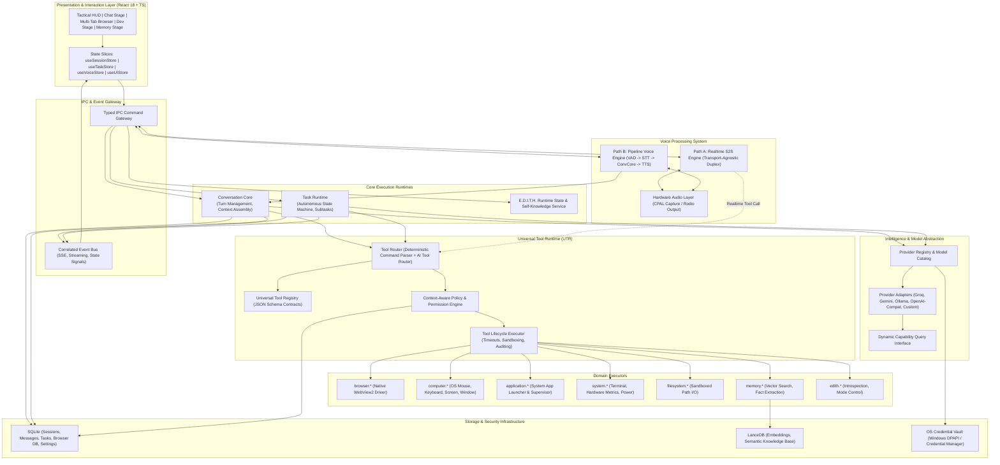

---

## 6. Layer & Responsibility Model

To prevent any component from expanding into a catch-all god object, V1.1 defines non-overlapping responsibilities and strict data contracts for every layer:

```
┌──────────────────────────────────┬──────────────────────────────────┬────────────────────────────────────────────────────────┐
│ Architectural Layer              │ Primary Components               │ Mandatory Responsibilities                             │
├──────────────────────────────────┼──────────────────────────────────┼────────────────────────────────────────────────────────┤
│ 1. Presentation Layer            │ React Views, Tactical Nav,       │ Pure presentation and local interaction; renders state │
│                                  │ Zustand/Context State Slices     │ from Event Bus; dispatches user actions to IPC Gateway.│
├──────────────────────────────────┼──────────────────────────────────┼────────────────────────────────────────────────────────┤
│ 2. Gateway & Event Bus           │ Tauri Commands, IPC Router,      │ Enforces type contracts across FFI; multiplexes events │
│                                  │ EdithEventEnvelope Multiplexer   │ with strict correlation IDs; isolates transport FFI.   │
├──────────────────────────────────┼──────────────────────────────────┼────────────────────────────────────────────────────────┤
│ 3. Execution Runtimes            │ Conversation Core,               │ Manages conversational turns, token budgets, and context;│
│                                  │ Task Runtime, Runtime State      │ Task Runtime supervises multi-step autonomous graphs.  │
├──────────────────────────────────┼──────────────────────────────────┼────────────────────────────────────────────────────────┤
│ 4. Intelligence Abstraction      │ Provider Registry, Model Catalog,│ Provides object-safe capability queries; transforms    │
│                                  │ Modular Provider Adapters        │ canonical chat requests to wire formats (HTTP/SSE/WS). │
├──────────────────────────────────┼──────────────────────────────────┼────────────────────────────────────────────────────────┤
│ 5. Universal Tool Runtime (UTR)  │ Tool Router, Tool Registry,      │ Maintains machine-readable tool schemas; evaluates     │
│                                  │ Policy Engine, Tool Executor     │ contextual risk; enforces approvals; audits tool calls.│
├──────────────────────────────────┼──────────────────────────────────┼────────────────────────────────────────────────────────┤
│ 6. Domain Executors              │ Browser, Computer, System,       │ Encapsulates low-level OS and subsystem drivers;       │
│                                  │ Application, FS, Memory, Edith   │ executes physical operations and returns typed data.   │
├──────────────────────────────────┼──────────────────────────────────┼────────────────────────────────────────────────────────┤
│ 7. Voice Processing System       │ Hardware Audio HAL,              │ Captures and plays audio; coordinates low-latency      │
│                                  │ Realtime Engine, Pipeline Engine │ realtime streaming duplex and modular pipeline fallback.│
├──────────────────────────────────┼──────────────────────────────────┼────────────────────────────────────────────────────────┤
│ 8. Storage & Security            │ SQLite, LanceDB,                 │ Manages persistent relational state, semantic vectors, │
│                                  │ OS Credential Vault (DPAPI)      │ and hardware-backed cryptographic secret isolation.    │
└──────────────────────────────────┴──────────────────────────────────┴────────────────────────────────────────────────────────┘
```

---

## 7. Provider Capability Architecture

### 7.1 Rejection of Monolithic Provider Traits
V1.0 defined a single `ProviderAdapter` trait that included methods for completion, streaming, tools, vision, STT, TTS, and realtime sessions. In Rust, this design introduces severe defects:
- **Object Safety Violations:** Traits with generic methods or disparate return types cannot be used as dynamic trait objects (`Box<dyn ProviderAdapter>`).
- **Forced Dummy Implementations:** A text-only provider (e.g., DeepSeek, Groq Text) is forced to implement dummy methods for speech synthesis and audio streaming, returning runtime errors.
- **Fragile Evolution:** Adding a new capability (e.g., Embeddings or Reasoning Token Inspection) requires modifying every existing adapter implementation.

### 7.2 V1.1 Fine-Grained Capability Traits
The revised architecture decouples provider identity from functional capabilities. A provider implements a base `Provider` trait and declares supported capabilities through capability queries.

```rust
// TARGET DESIGN: src-tauri/src/ai/provider.rs
use async_trait::async_trait;
use std::sync::Arc;
use tokio::sync::mpsc::Sender;
use crate::ai::types::*;

/// Base trait implemented by all AI providers (Identity & Discovery)
#[async_trait]
pub trait Provider: Send + Sync {
    fn id(&self) -> &str;
    fn display_name(&self) -> &str;
    fn capabilities(&self) -> CapabilitySet;
    async fn list_models(&self) -> Result<Vec<ModelMetadata>, ProviderError>;
    
    // Capability Downcasting / Query Methods
    fn as_text(&self) -> Option<&dyn TextGenerationCapability> { None }
    fn as_streaming(&self) -> Option<&dyn StreamingTextCapability> { None }
    fn as_tool_calling(&self) -> Option<&dyn ToolCallingCapability> { None }
    fn as_vision(&self) -> Option<&dyn VisionCapability> { None }
    fn as_realtime(&self) -> Option<&dyn RealtimeAudioCapability> { None }
    fn as_embedding(&self) -> Option<&dyn EmbeddingCapability> { None }
}

#[async_trait]
pub trait TextGenerationCapability: Send + Sync {
    async fn generate_text(&self, req: CompletionRequest) -> Result<CompletionResponse, ProviderError>;
}

#[async_trait]
pub trait StreamingTextCapability: Send + Sync {
    async fn stream_text(
        &self, 
        req: CompletionRequest, 
        tx: Sender<StreamChunk>
    ) -> Result<CompletionResponse, ProviderError>;
}

#[async_trait]
pub trait ToolCallingCapability: Send + Sync {
    async fn generate_with_tools(
        &self, 
        req: ToolCompletionRequest
    ) -> Result<ToolCompletionResponse, ProviderError>;
    
    async fn stream_with_tools(
        &self, 
        req: ToolCompletionRequest, 
        tx: Sender<ToolStreamChunk>
    ) -> Result<ToolCompletionResponse, ProviderError>;
}

#[async_trait]
pub trait RealtimeAudioCapability: Send + Sync {
    async fn start_realtime_session(
        &self, 
        config: RealtimeConfig, 
        transport: Box<dyn RealtimeTransport>
    ) -> Result<Box<dyn RealtimeSessionControl>, ProviderError>;
}

#[async_trait]
pub trait EmbeddingCapability: Send + Sync {
    async fn embed_text(&self, texts: &[String]) -> Result<Vec<Vec<f32>>, ProviderError>;
}
```

### 7.3 Model Catalog & Configuration Structure
Provider metadata and available models are stored in SQLite, while API keys and authorization tokens are strictly segregated into the OS Credential Vault.

```sql
-- TARGET RELATIONAL SCHEMA: SQLite (Configuration only, NO plaintext secrets)
CREATE TABLE providers (
    id TEXT PRIMARY KEY,               -- e.g. "groq", "gemini", "local_ollama"
    name TEXT NOT NULL,
    adapter_type TEXT NOT NULL,        -- "openai_compatible", "gemini_native", "ollama_local"
    base_url TEXT NOT NULL,
    credential_vault_key TEXT,         -- Key reference in OS Credential Manager
    capabilities_mask INTEGER NOT NULL,
    is_custom BOOLEAN NOT NULL DEFAULT 0,
    is_enabled BOOLEAN NOT NULL DEFAULT 1,
    created_at INTEGER NOT NULL,
    updated_at INTEGER NOT NULL
);

CREATE TABLE provider_models (
    provider_id TEXT NOT NULL,
    model_id TEXT NOT NULL,            -- e.g. "llama-3.3-70b-versatile", "gemini-2.0-flash"
    display_name TEXT NOT NULL,
    context_window INTEGER NOT NULL DEFAULT 8192,
    max_output_tokens INTEGER,
    supports_vision BOOLEAN NOT NULL DEFAULT 0,
    supports_tools BOOLEAN NOT NULL DEFAULT 1,
    supports_streaming BOOLEAN NOT NULL DEFAULT 1,
    cost_per_1k_input_micros INTEGER DEFAULT 0,
    cost_per_1k_output_micros INTEGER DEFAULT 0,
    PRIMARY KEY (provider_id, model_id),
    FOREIGN KEY (provider_id) REFERENCES providers(id) ON DELETE CASCADE
);
```

---

## 8. Conversation / Turn / Task Model

To prevent `ConversationCore` from degenerating into a chaotic orchestrator, V1.1 strictly separates human-interactive conversation turns from autonomous task workflows.

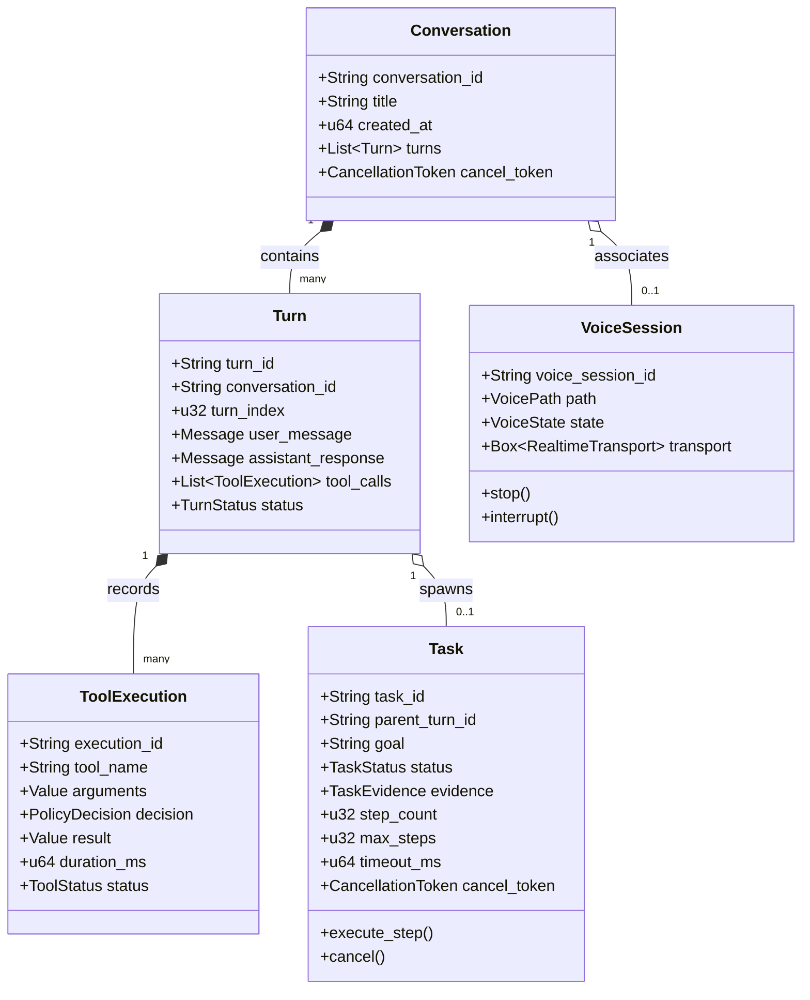

### Entity Responsibilities and Lifecycles:

| Entity | Lifecycle Owner | State Boundary | Concurrency Model |
| :--- | :--- | :--- | :--- |
| **Conversation** | `ConversationManager` | Session history, user memory, message threads. Persisted in SQLite `conversations`. | Multiple conversations exist concurrently; only one foreground conversation active in UI. |
| **Turn** | `ConversationCore` | Atomic human prompt → reasoning → tool execution → assistant reply cycle. | Sequential within a conversation; concurrent across conversations. |
| **Task** | `TaskRuntime` | Long-running, multi-step goal oriented state machine (e.g., autonomous web research, workspace refactoring). | Asynchronous; runs in background Tokio tasks with independent cancellation tokens. |
| **ToolExecution** | `ToolExecutor` | Bounded invocation of a specific domain tool. Validated by Policy Engine; audited in SQLite. | Concurrent execution allowed for independent read-only tools; serialized for mutating tools. |
| **VoiceSession** | `VoiceCoordinator` | Continuous hardware audio stream (Path A Realtime duplex or Path B pipeline). | Exactly one active voice session system-wide. Interrupted by hardware barge-in. |
| **ProviderRequest** | `ProviderAdapter` | Ephemeral network socket / SSE HTTP streaming request. | Scoped to individual turns or task steps. Aborted on cancellation token signal. |

---

## 9. Runtime State Model

V1.0 relied on a primitive `active_session_id`. The V1.1 architecture establishes an authoritative, thread-safe **Runtime State Model** managed by the backend `RuntimeStateService`.

```rust
// TARGET DESIGN: src-tauri/src/core/runtime_state.rs
use std::collections::HashMap;
use std::sync::Arc;
use tokio::sync::RwLock;
use serde::{Deserialize, Serialize};
use uuid::Uuid;

#[derive(Debug, Clone, Serialize, Deserialize)]
pub struct EdithRuntimeState {
    // 1. Authoritative Navigation & Active Focus
    pub active_view: ViewTab,
    pub foreground_conversation_id: Option<String>,
    
    // 2. Active Asynchronous Workflows
    pub running_tasks: HashMap<String, RunningTaskSnapshot>,
    
    // 3. Hardware & Domain Locks
    pub active_voice_session: Option<VoiceSessionSnapshot>,
    pub browser_tab_ownership: HashMap<String, TabOwnership>, // "USER" | "AGENT_TEMPORARY"
    
    // 4. Intelligence & Capabilities Configuration
    pub active_provider_id: String,
    pub active_model_id: String,
    pub available_capabilities: Vec<String>,
    
    // 5. Host Security & Permissions State
    pub pending_authorizations: Vec<PendingAuthorizationSummary>,
    
    // 6. System Telemetry & Metrics
    pub hardware_metrics: SystemMetricsSnapshot,
}
```

### State Categorization & Boundary Grid:

```
┌────────────────────────┬─────────────────────────┬───────────────────────────┬──────────────────────────────────────────┐
│ State Category         │ Authoritative Owner     │ Persistence Strategy      │ Propagation Mechanism                   │
├────────────────────────┼─────────────────────────┼───────────────────────────┼──────────────────────────────────────────┤
│ Runtime Execution State│ Rust Backend            │ In-Memory (Arc<RwLock>)   │ Pushed via Event Multiplexer:            │
│ (Tasks, Locks, Voice)  │ RuntimeStateService     │ (Volatile across restart) │ "runtime:state-updated"                  │
├────────────────────────┼─────────────────────────┼───────────────────────────┼──────────────────────────────────────────┤
│ Conversational State   │ Rust Backend            │ SQLite Database           │ Loaded on conversation switch;           │
│ (Messages, Turns)      │ ConversationManager     │ (Persistent)              │ Live streamed via "stream:chunk" events. │
├────────────────────────┼─────────────────────────┼───────────────────────────┼──────────────────────────────────────────┤
│ Browser Automation     │ Rust Backend            │ In-Memory + SQLite        │ Synchronized via browserController.ts;   │
│ (Tabs, DOM cache, Dev) │ BrowserState Manager    │ (Tabs saved to SQLite)    │ Emitted via "browser:state-changed".     │
├────────────────────────┼─────────────────────────┼───────────────────────────┼──────────────────────────────────────────┤
│ UI View State          │ React Frontend          │ Client Memory             │ Pure React state / Zustand slices;       │
│ (Scroll, Modals, Focus)│ View Components         │ (Ephemeral)               │ Never touches Rust backend FFI.          │
├────────────────────────┼─────────────────────────┼───────────────────────────┼──────────────────────────────────────────┤
│ Secrets & Credentials  │ OS Credential Vault     │ OS Secure Store (DPAPI)   │ Queried on demand by Provider Registry;  │
│ (API Keys, Tokens)     │ (Platform Keyring)      │ (Encrypted at rest)       │ NEVER sent to frontend UI layer.         │
└────────────────────────┴─────────────────────────┴───────────────────────────┴──────────────────────────────────────────┘
```

---

## 10. Event & Correlation Model

To permanently eliminate token cross-talk, race conditions, and ambiguous event handling, all asynchronous events pass through a **Correlated Event Taxonomy**.

```rust
// TARGET DESIGN: src-tauri/src/events/envelope.rs
use serde::{Deserialize, Serialize};
use uuid::Uuid;

#[derive(Debug, Clone, Serialize, Deserialize)]
pub struct EdithEventEnvelope<T> {
    pub event_id: Uuid,
    pub timestamp_ms: u64,
    
    // Scoped Correlation Identifiers
    pub correlation: EventCorrelation,
    
    // Strongly Typed Event Payload
    pub payload: T,
}

#[derive(Debug, Clone, Serialize, Deserialize)]
pub struct EventCorrelation {
    pub conversation_id: Option<String>,
    pub turn_id: Option<String>,
    pub task_id: Option<String>,
    pub stream_id: Option<Uuid>,
    pub tool_execution_id: Option<String>,
    pub voice_session_id: Option<String>,
}

#[derive(Debug, Clone, Serialize, Deserialize)]
#[serde(tag = "event_type", content = "data")]
pub enum EdithPayload {
    // LLM Stream Chunks
    StreamToken { text: String, index: u32, is_final: bool },
    
    // Tool Execution Lifecycle
    ToolProposed { execution_id: String, tool_name: String, risk_tier: String, summary: String },
    ToolStarted { execution_id: String, tool_name: String },
    ToolCompleted { execution_id: String, tool_name: String, success: bool, duration_ms: u64 },
    
    // Autonomous Task Progress
    TaskStepProgress { task_id: String, step: u32, max_steps: u32, status_text: String },
    TaskFinished { task_id: String, success: bool, summary: String },
    
    // Voice Engine States
    VoiceStateChanged { state: VoiceEngineState, decibel: f32 },
    VoiceBargeInTriggered { interrupted_source: String },
}
```

---

## 11. Universal Tool Runtime (UTR)

The Universal Tool Runtime eliminates string parsing by enforcing machine-readable JSON Schema contracts across all tools.

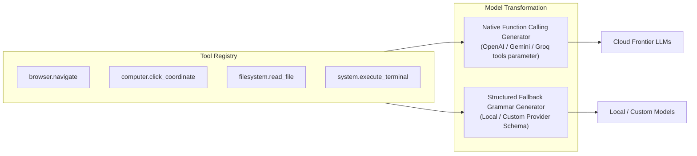

### 11.1 Universal Tool Contract Definition

```rust
// TARGET DESIGN: src-tauri/src/tools/contract.rs
use serde::{Deserialize, Serialize};

#[derive(Debug, Clone, Serialize, Deserialize)]
pub struct ToolContract {
    pub name: String,                  // e.g. "filesystem.read_file"
    pub domain: ToolDomain,            // Browser, Computer, System, Application, Filesystem, Memory, Edith
    pub description: String,
    pub parameters_schema: serde_json::Value, // Strict JSON Schema
    pub return_schema: serde_json::Value,
    pub is_read_only: bool,
    pub default_timeout_ms: u64,
}

#[derive(Debug, Clone, Copy, PartialEq, Eq, Hash, Serialize, Deserialize)]
pub enum ToolDomain {
    Browser,
    Computer,
    Application,
    System,
    Filesystem,
    Memory,
    Edith,
}
```

---

## 12. Tool Router & Deterministic Command Engine

V1.0 claimed "all intents disappear." This is an architectural fallacy. Explicit user commands (e.g., UI buttons, exact keyboard shortcuts, tactical shell prefixes) must be routed deterministically without invoking slow, expensive LLM calls.

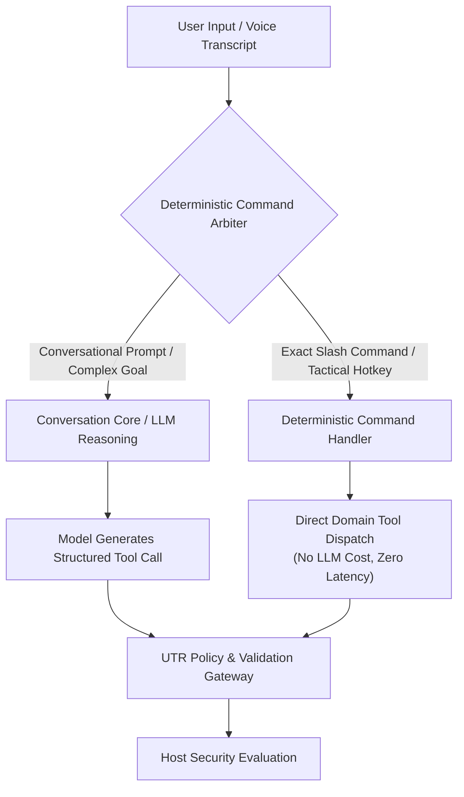

### Deterministic vs. Reasoning Matrix:
- **Deterministic Route:** Commands such as `/reset`, `/export`, `volume up`, `mute`, or omnibox URL submissions bypass LLM reasoning and dispatch directly to the tool executor.
- **LLM Reasoning Route:** Queries like "Find the flight tickets I looked at yesterday and summarize the prices" invoke the model to reason over available tools (`browser.history_search`, `browser.navigate`, `browser.observe`).

---

## 13. Policy & Permission Engine

Risk is not a static property of a tool name. Clicking a navigation link on Wikipedia is benign; clicking "Confirm Transfer" on a banking portal is critical. Executing `cargo check` in a project directory is safe; executing `rm -rf /` or `format C:` is catastrophic.

### 13.1 Dynamic Contextual Evaluation Model
The V1.1 Policy Engine evaluates risk as a function of multiple dynamic variables:

$$\text{Decision} = f(\text{Tool}, \text{Arguments}, \text{Target}, \text{WorkspaceSandbox}, \text{OperatorGrants})$$

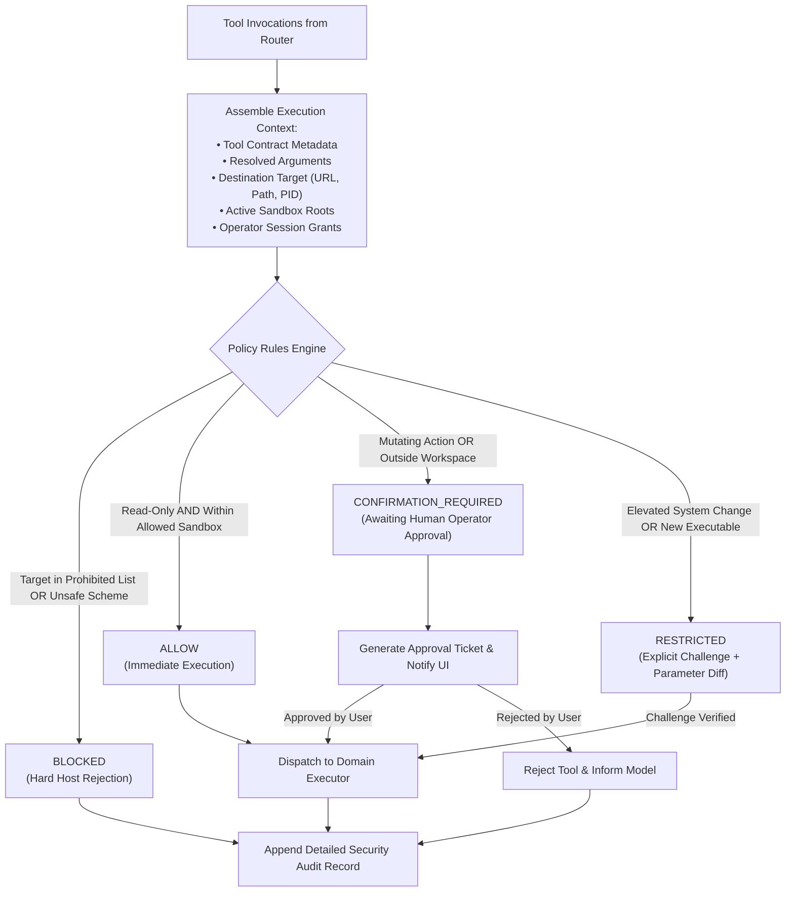

### 13.2 Concrete Dynamic Policy Examples:
1. **`filesystem.read_file`:**
   - Target inside project workspace: **`ALLOW`** (Immediate execution).
   - Target outside workspace (e.g., `C:\Users\Admin\.ssh\id_rsa`): **`BLOCKED`**.
2. **`system.execute_terminal`:**
   - Command `cargo check` in workspace: **`ALLOW`**.
   - Command `npm install express` in workspace: **`CONFIRMATION_REQUIRED`**.
   - Command containing chaining operators (`&`, `|`, `;`) or obfuscated base64: **`BLOCKED`**.
3. **`browser.click`:**
   - Clicking pagination button `el_next_page`: **`ALLOW`**.
   - Clicking button with text "Delete Account" or payment checkout: **`CONFIRMATION_REQUIRED`**.

---

## 14. Browser Domain Architecture

The existing browser implementation in [`src-tauri/src/browser.rs`](file:///e:/Projects/E.D.I.T.H/src-tauri/src/browser.rs) and [`src-tauri/src/browser_tools.rs`](file:///e:/Projects/E.D.I.T.H/src-tauri/src/browser_tools.rs) represents over 3,000 lines of hardened code that **must remain the foundational driver**.

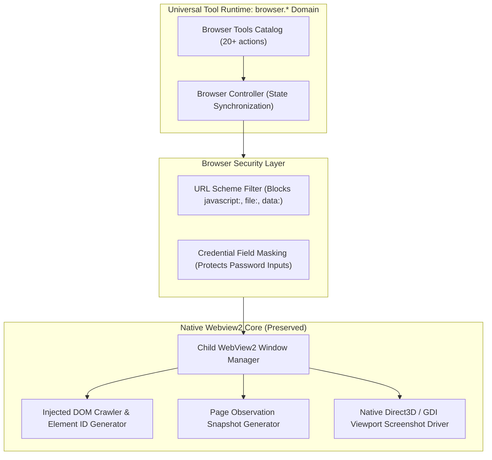

### Structural Alignment:
- **Browser Driver:** [`browser.rs`](file:///e:/Projects/E.D.I.T.H/src-tauri/src/browser.rs) is maintained as the physical driver managing native child WebViews.
- **Browser Domain Tools:** Tools in [`browser_tools.rs`](file:///e:/Projects/E.D.I.T.H/src-tauri/src/browser_tools.rs) are wrapped into the UTR under names like `browser.observe`, `browser.navigate`, `browser.click`, `browser.type`, `browser.tab_group_create`.
- **Browser Tasks:** Multi-tab workflows from [`browser_orchestrator.rs`](file:///e:/Projects/E.D.I.T.H/src-tauri/src/browser_orchestrator.rs) run as structured background tasks inside the new `TaskRuntime`.

---

## 15. Computer / Application / System / Filesystem Domains

To prevent creating a new "system" monolith, desktop capabilities are partitioned into distinct, cohesive namespaces:

```
┌────────────────────────┬─────────────────────────────────┬────────────────────────────────────────────────────────┐
│ Namespace              │ Managed Resources               │ Canonical Tool Examples                                │
├────────────────────────┼─────────────────────────────────┼────────────────────────────────────────────────────────┤
│ **computer.***         │ OS User Input & Screen Displays │ `computer.mouse_move`, `computer.mouse_click`,          │
│                        │                                 │ `computer.keyboard_press`, `computer.capture_screen`,  │
│                        │                                 │ `computer.window_focus`, `computer.window_minimize`    │
├────────────────────────┼─────────────────────────────────┼────────────────────────────────────────────────────────┤
│ **application.***      │ Installed Applications & PIDs   │ `application.launch`, `application.terminate`,         │
│                        │                                 │ `application.list_installed`, `application.get_status` │
├────────────────────────┼─────────────────────────────────┼────────────────────────────────────────────────────────┤
│ **filesystem.***       │ Sandboxed Disk I/O              │ `filesystem.read_file`, `filesystem.write_file`,       │
│                        │                                 │ `filesystem.list_directory`, `filesystem.search_files` │
├────────────────────────┼─────────────────────────────────┼────────────────────────────────────────────────────────┤
│ **system.***           │ Hardware & OS Environment       │ `system.get_metrics`, `system.execute_terminal`,       │
│                        │                                 │ `system.control_audio`, `system.show_notification`     │
└────────────────────────┴─────────────────────────────────┴────────────────────────────────────────────────────────┘
```

### Safety Rules:
- **Fail-Safe Mechanism:** Hardcoded fail-safe corner for mouse control (moving mouse to coordinate `(0, 0)` immediately aborts input automation).
- **Filesystem Containment:** Canonicalized path resolution prevents directory traversal (`../`) outside designated project roots.

---

## 16. Voice Architecture

The voice architecture decouples physical audio hardware from AI reasoning and speech processing models.

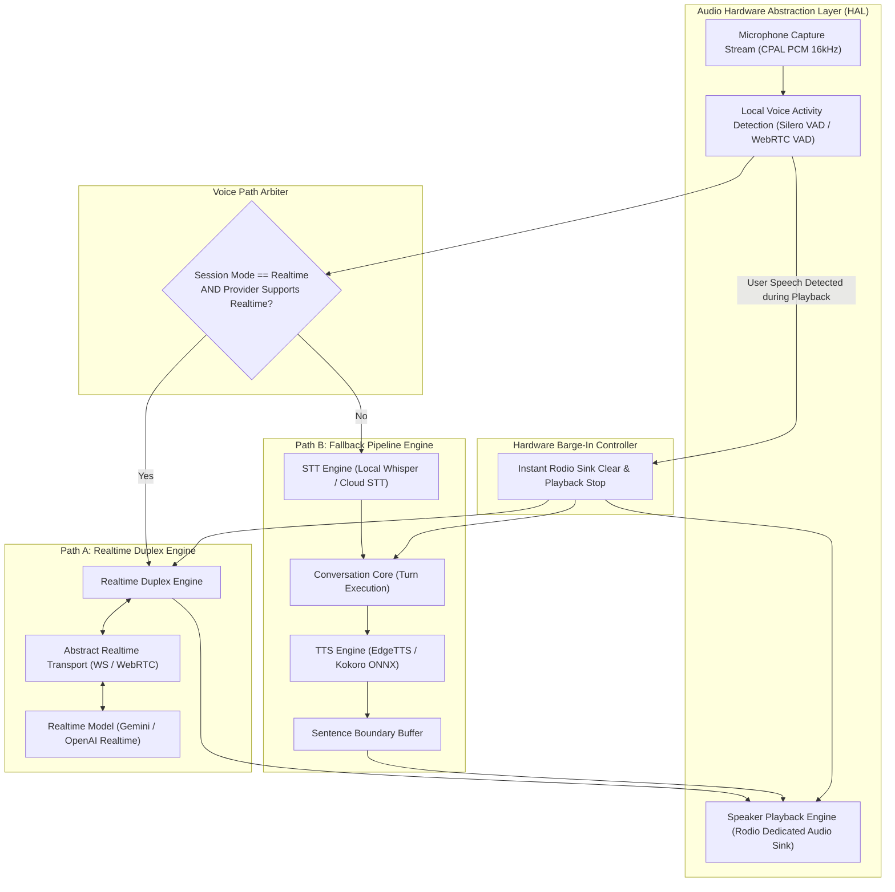

### Key Technical Specifications:
- **Zero Echo / Single Output Sink:** Audio is played **exclusively** through the backend Rodio sink. Base64 audio strings are NEVER played in the browser DOM.
- **Instant Hardware Barge-In:** When the local VAD detects operator speech, the Rodio sink buffer is flushed immediately in < 20ms, stopping assistant speech before network cancellation completes.

---

## 17. Realtime Transport Abstraction

The Realtime Voice Engine must not depend on a specific network protocol. It communicates over an abstract bidirectional frame stream.

```rust
// TARGET DESIGN: src-tauri/src/voice/transport.rs
use async_trait::async_trait;
use tokio::sync::mpsc::{Sender, Receiver};

#[derive(Debug, Clone)]
pub enum AudioFrame {
    Pcm16Chunk { samples: Vec<i16>, sample_rate: u32 },
    TextMessage(String),
    InterruptSignal,
}

#[async_trait]
pub trait RealtimeTransport: Send + Sync {
    async fn connect(&mut self, endpoint: &str, auth_header: Option<&str>) -> Result<(), TransportError>;
    async fn send_frame(&mut self, frame: AudioFrame) -> Result<(), TransportError>;
    async fn receive_frame(&mut self) -> Result<Option<AudioFrame>, TransportError>;
    async fn close(&mut self) -> Result<(), TransportError>;
}
```

### Supported Concrete Transports:
1. **WebSocket Transport:** Used for Gemini Live and OpenAI Realtime WebSocket APIs.
2. **WebRTC Data & Media Transport:** Used for peer-to-peer or media server configurations.
3. **Local IPC Stream:** Used for local speech-to-speech models running as sidecars.

---

## 18. Memory Architecture & Significance Extraction

The practice of automatically dumping every conversational turn into LanceDB is replaced by an intentional, multi-tier memory architecture.

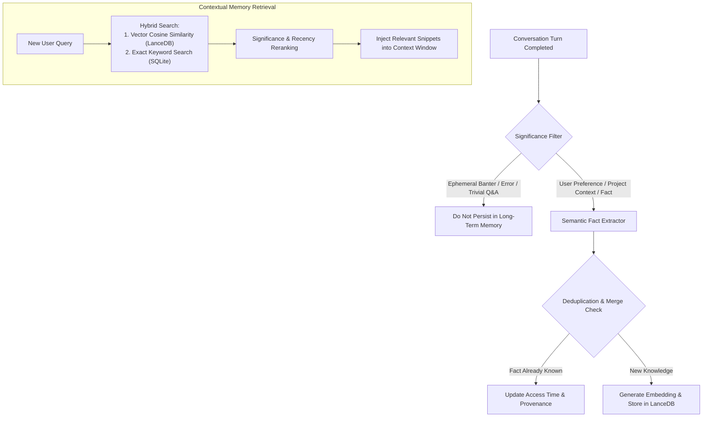

### Memory Classification:
- **Conversation History:** Ephemeral turns stored in SQLite `messages` table for chat display.
- **Working Context:** Compressed summary of current mission state in active memory.
- **Long-Term Memory:** High-entropy user facts, coding guidelines, and project specifications in LanceDB with provenance tags (`source`, `timestamp`, `confidence`).

---

## 19. Persistence & Secret Management

Storing sensitive API keys in SQLite plaintext columns is a security violation. V1.1 strictly bifurcates non-sensitive configuration data from cryptographic secrets.

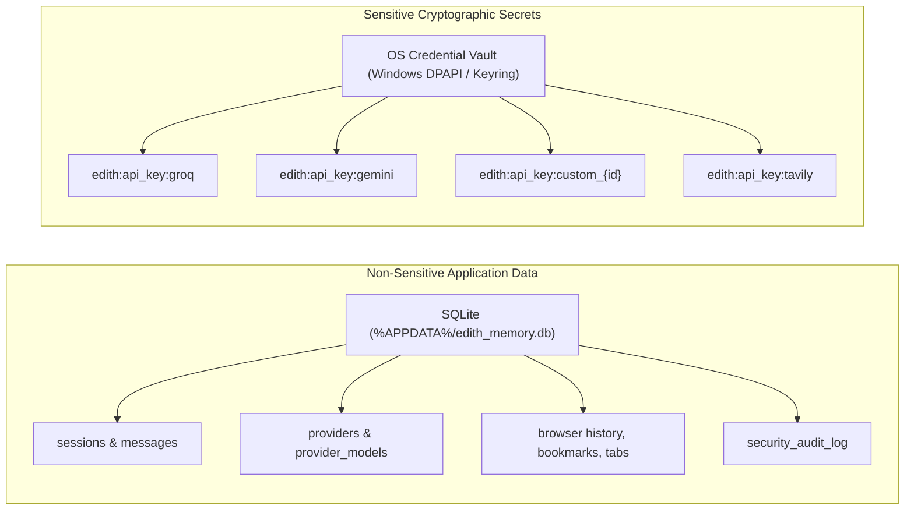

### Vault Integration Rules:
1. The SQLite database stores only the vault reference key (`credential_vault_key`), never the actual secret.
2. The Rust backend queries the OS Credential Manager exclusively when creating network request headers.
3. Secret values are **zeroized in memory** after use and are NEVER sent over Tauri IPC to the frontend DOM.

---

## 20. E.D.I.T.H. Self-Knowledge Architecture

E.D.I.T.H.'s self-awareness is achieved dynamically through queryable inspection tools rather than thousands of static system prompt tokens.

```rust
// TARGET DESIGN: src-tauri/src/tools/domains/edith.rs
// Tool: edith.get_runtime_status
#[derive(Serialize)]
pub struct EdithStatusResponse {
    pub identity: &'static str,         // "E.D.I.T.H. Mark-85"
    pub version: &'static str,          // "1.1.0"
    pub runtime_mode: String,           // "TacticalChat", "AutonomousBrowser", "Developer"
    pub active_provider: String,
    pub active_model: String,
    pub available_tool_domains: Vec<String>,
    pub running_background_tasks: usize,
    pub active_browser_tabs: usize,
    pub pending_authorizations: usize,
    pub system_memory_usage_mb: u64,
}
```

When the user asks "What capabilities do you have right now?" or "Which provider are you using?", the model calls `edith.get_runtime_status` and formulates an accurate, grounded answer based on live host state.

---

## 21. Security Boundary Summary

The security boundary in V1.1 is **100% host-enforced**. The AI model is an untrusted entity proposing actions; the host runtime is the authoritative gatekeeper.

```
       AI Model (Untrusted Proposer)
                    │
                    ▼  Proposes Tool Call (name, args)
    ┌───────────────────────────────┐
    │     Universal Tool Router     │
    └───────────────┬───────────────┘
                    ▼
    ┌───────────────────────────────┐
    │  Dynamic Policy Engine (Host) │ ◄── Context: Active Sandbox, Operator Consents
    └───────────────┬───────────────┘
                    │
       ┌────────────┼────────────┐
       ▼            ▼            ▼
   [ BLOCKED ] [ CONFIRM ]   [ ALLOW ]
       │            │            │
  Host Rejects  UI Prompt        │
       │        (Operator)       │
       │       Approved?         │
       │       YES     NO        │
       │        │       │        │
       │        ▼       ▼        │
       │    [ Execute Tool ]     │
       │            │            │
       ▼            ▼            ▼
    ┌───────────────────────────────┐
    │   Append Security Audit Log   │ ──► SQLite (Tamper-evident records)
    └───────────────────────────────┘
```

---

## 22. Migration Roadmap

The migration follows a strict, dependency-ordered 12-phase roadmap designed for **zero regressions** and immediate verification at every step.

```mermaid
gantt
    title E.D.I.T.H. AI Core V1.1 Migration Schedule
    dateFormat  X
    axisFormat Phase %d

    section Foundations
    Phase 1 : Event Correlation & Secret Vault Infrastructure :active, 0, 1
    Phase 2 : Capability-Based Provider Abstraction           : 1, 2
    Phase 3 : Central Policy Engine & Unified Approvals      : 2, 3

    section Core Runtimes
    Phase 4 : Universal Tool Runtime & Registry Contracts    : 3, 4
    Phase 5 : Conversation Core & Session State Engine       : 4, 5
    Phase 6 : Task Runtime & Autonomous Workflow Engine      : 5, 6
    Phase 7 : Tool Router & Deterministic Command Engine     : 6, 7

    section Domains & Voice
    Phase 8 : Browser Domain Migration to UTR                : 7, 8
    Phase 9 : Computer, App, FS & System Domain Migration    : 8, 9
    Phase 10: Memory Pipeline & Significance Gate            : 9, 10
    Phase 11: Modular Audio HAL & Fallback Voice Overhaul    : 10, 11
    Phase 12: Realtime Duplex Voice Engine (Path A)          : 11, 12
```

### Phase Summary:

#### Phase 1: Event Correlation & Secret Vault Infrastructure
- **Prerequisites:** None.
- **Architectural Changes:** Implement `EdithEventEnvelope` in Rust; implement OS Credential Vault bindings (Windows DPAPI via `keyring-rs`).
- **Tests:** Event serialization tests; secret roundtrip encryption tests.

#### Phase 2: Capability-Based Provider Abstraction
- **Prerequisites:** Phase 1.
- **Architectural Changes:** Implement `Provider` trait and capability downcasting. Build adapters for Groq, Gemini, and Ollama.
- **Tests:** Mock HTTP provider completion and streaming tests.

#### Phase 3: Central Policy Engine & Unified Approvals
- **Prerequisites:** Phase 1.
- **Architectural Changes:** Merge `security.rs` and `browser_risk.rs` into `policy_engine.rs`. Unify approval ticket structures.
- **Tests:** Dynamic path traversal tests; command injection tests; approval state tests.

#### Phase 4: Universal Tool Runtime & Registry Contracts
- **Prerequisites:** Phase 3.
- **Architectural Changes:** Implement `ToolContract` and JSON Schema validation. Generate native LLM tool definitions.
- **Tests:** Schema validation unit tests; JSON Schema roundtrip tests.

#### Phase 5: Conversation Core & Session State Engine
- **Prerequisites:** Phases 2, 3, 4.
- **Architectural Changes:** Shift conversational turn coordination out of `ChatView.tsx` into backend `ConversationCore`.
- **Tests:** Multi-turn headless conversation tests; token budgeting tests.

#### Phase 6: Task Runtime & Autonomous Workflow Engine
- **Prerequisites:** Phases 4, 5.
- **Architectural Changes:** Create `TaskRuntime` managing multi-step background state machines.
- **Tests:** Multi-step mock task execution; cancellation token tests.

#### Phase 7: Tool Router & Deterministic Command Engine
- **Prerequisites:** Phases 4, 5, 6.
- **Architectural Changes:** Build Route Arbiter separating slash commands from LLM tool reasoning.
- **Tests:** Deterministic command matching unit tests.

#### Phase 8: Browser Domain Migration to UTR
- **Prerequisites:** Phases 4, 7.
- **Architectural Changes:** Map `browser_tools.rs` actions into `browser.*` contracts. Reconnect `browser_orchestrator.rs` to Task Runtime.
- **Tests:** Playwright browser automation verification suite.

#### Phase 9: Computer, App, FS & System Domain Migration
- **Prerequisites:** Phases 4, 7.
- **Architectural Changes:** Map mouse, keyboard, screen capture, app launcher, and sandboxed file I/O to UTR.
- **Tests:** Mouse fail-safe corner test; filesystem sandbox boundary tests.

#### Phase 10: Memory Pipeline & Significance Gate
- **Prerequisites:** Phase 5.
- **Architectural Changes:** Replace automatic LanceDB dumping with significance extractor and deduplication filter.
- **Tests:** Memory extraction precision tests; vector cosine similarity tests.

#### Phase 11: Modular Audio HAL & Fallback Voice Overhaul
- **Prerequisites:** Phase 5.
- **Architectural Changes:** Implement dedicated Rodio output sink (fix dual playback); integrate native audio capture and local VAD.
- **Tests:** VAD trigger accuracy tests; single-sink audio output tests.

#### Phase 12: Realtime Duplex Voice Engine (Path A)
- **Prerequisites:** Phases 11, 2.
- **Architectural Changes:** Build transport-agnostic `RealtimeVoiceEngine` supporting bidirectional WebSocket/WebRTC streaming.
- **Tests:** Barge-in latency tests (< 400ms target); frame buffer overrun tests.

---

## 23. Architecture Guardrails

To preserve architectural integrity during implementation, the following **strict constraints** must be enforced:

1. **NO Monolithic Traits:** Never combine disparate capabilities into a single provider interface. Every capability must remain an independent, optional trait.
2. **NO UI-Owned Orchestration:** React components must never coordinate multi-turn AI workflows, manage tool loops, or directly trigger persistence operations.
3. **NO Direct AI Authority over Permissions:** The AI model is an untrusted proposer. All execution permissions must be evaluated by the host Policy Engine.
4. **NO String-Based Tool Formats in New Code:** All new tools must declare machine-readable JSON Schema contracts.
5. **NO Uncorrelated Events:** All backend-to-frontend streaming tokens and status notifications must carry an `EdithEventEnvelope` with correlation IDs.
6. **NO Plaintext Secrets in Application Databases:** API keys and credentials must be stored exclusively in the OS Credential Vault.
7. **NO Audio Playback via the Browser DOM:** Synthesized speech must be dispatched exclusively through the backend audio HAL.

---

## 24. Testing & Verification Strategy

Every migration phase must satisfy strict regression gates before proceeding:

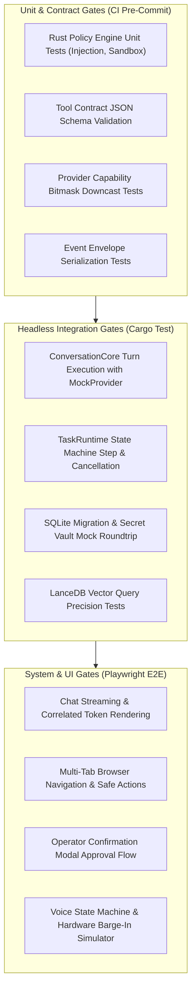

---

## 25. Architectural Risks

| Risk | Impact | Architectural Mitigation in V1.1 |
| :--- | :--- | :--- |
| **Provider API Drift** | Upstream API schema updates break provider adapters. | Isolated provider adapters; integration test suite running against mock provider recordings. |
| **Barge-In Latency Overrun** | Speech continues after user speaks, causing confusion. | Silero VAD runs directly on input audio buffer in Rust, executing an instant hardware mute in < 20ms. |
| **Desktop Automation Lockup** | Scripted mouse or keyboard sequences block user input. | Hardware fail-safe corner `(0, 0)` immediately halts all desktop automation drivers. |
| **Context Window Overflow** | Ingesting large files or DOM trees exceeds context limits. | Conversation Core token budgeter dynamically truncates DOM trees and compresses older conversation turns. |
| **Memory Extraction Drift** | Model stores incorrect or hallucinated facts in LanceDB. | Significance filter evaluates factual confidence before generating embeddings. |

---

## 26. Architecture Decisions (ADRs)

### ADR-01: Fine-Grained Capability Traits vs. Monolithic Provider
- **Decision:** Providers implement a minimal base `Provider` trait and declare capabilities through dynamic downcasting (`as_text()`, `as_streaming()`, `as_tools()`, `as_realtime()`).
- **Reason:** Solves Rust object safety issues, eliminates forced dummy implementations, and enables easy addition of future modalities.
- **Alternatives Considered:** Monolithic trait (V1.0) — Rejected due to Interface Segregation violation and object safety breakdown.

### ADR-02: Separation of Conversation Core and Task Runtime
- **Decision:** Decouple human conversational turns (`ConversationCore`) from autonomous multi-step background tasks (`TaskRuntime`).
- **Reason:** Autonomous browser workflows and project builds must run asynchronously in background threads without blocking or corrupting foreground chat history.
- **Alternatives Considered:** Single shared runtime — Rejected due to state pollution and thread-blocking risks.

### ADR-03: Dynamic Context-Aware Policy vs. Static Risk Tiers
- **Decision:** Evaluate security dynamically: $f(\text{Tool}, \text{Args}, \text{Target}, \text{Context}, \text{Consents}) \to \text{Decision}$.
- **Reason:** Static risk tiers cannot distinguish between safe workspace reads and dangerous external system modifications.
- **Alternatives Considered:** Static tool name tiers (V1.0) — Rejected as inadequate for desktop security.

### ADR-04: Transport-Agnostic Audio Streaming Frame Bus
- **Decision:** Build Realtime S2S voice over an abstract `RealtimeTransport` trait passing raw audio frames.
- **Reason:** Prevents vendor lock-in to WebSockets; allows seamless migration to WebRTC or local IPC.
- **Alternatives Considered:** Hardcoded WebSocket client (V1.0) — Rejected for lack of flexibility.

### ADR-05: OS-Native Secret Isolation via DPAPI
- **Decision:** Store API keys in the Windows Credential Manager / OS Keyring, referencing them by key ID in SQLite.
- **Reason:** Encrypting SQLite columns requires local key management, which is vulnerable to extraction. OS credential vaults provide native hardware-backed protection.
- **Alternatives Considered:** Encrypted SQLite columns — Rejected as insecure for desktop distribution.

---

## 27. Open Questions

1. **Local Voice Model Footprint Budget:** What is the maximum acceptable disk footprint for local voice on operator machines? (Silero VAD [~5MB] + Kokoro TTS [~80MB] + Whisper-tiny [~75MB] vs. Whisper-base [~145MB]).
2. **Audio Buffer Ring Sizing:** What is the optimal ring buffer size for native CPAL audio capture to prevent underflows on lower-tier CPU architectures?
3. **Cross-Platform Driver Abstractions:** While current implementations focus on Windows APIs (PowerShell COM, Win32 child webviews), should `computer.*` drivers include stub definitions for macOS Accessibility APIs and Linux Wayland/X11?

---

## 28. Acceptance Criteria (Definition of Done for Architecture V1.1)

- [x] **Critical Review of V1.0 Completed:** All 10 major V1.0 weaknesses analyzed and resolved.
- [x] **Zero Implementation Rule Enforced:** No source code, dependencies, or database schemas modified during this stage.
- [x] **Provider Capability Architecture Formulated:** Object-safe traits defined with dynamic capability queries.
- [x] **Turn vs. Task Lifecycle Formalized:** Distinct models established for conversations, turns, tasks, and tool executions.
- [x] **Context-Aware Security Model Established:** Dynamic policy engine specified to replace static tool name tiers.
- [x] **Single-Sink Audio Pipeline Defined:** Dual-playback bug resolved; hardware audio sink specified as sole authority.
- [x] **Correlated Event Taxonomy Defined:** `EdithEventEnvelope` specified with full correlation scopes.
- [x] **12-Phase Dependency-Ordered Roadmap Delivered:** Complete migration plan with regression gates and rollback strategies.

---

*End of Architecture Specification — E.D.I.T.H. AI Core v1.1*
