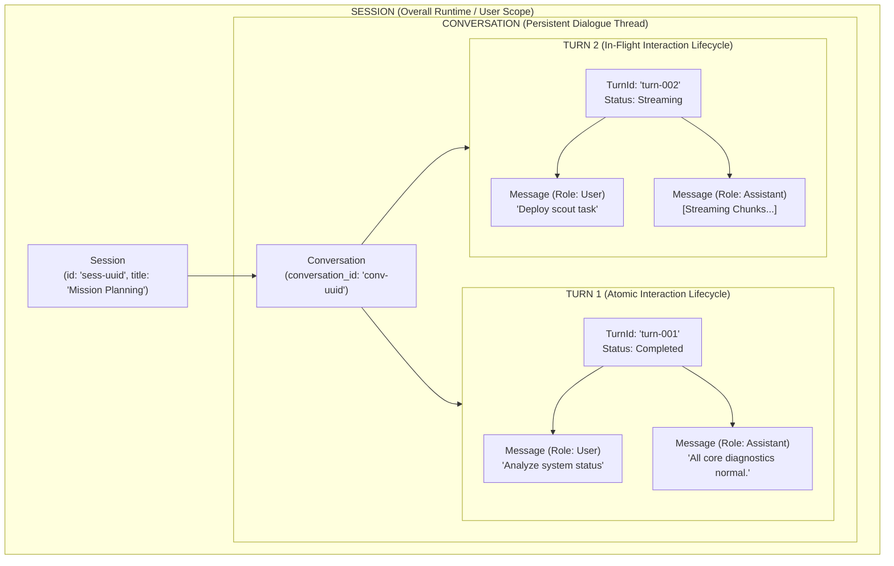
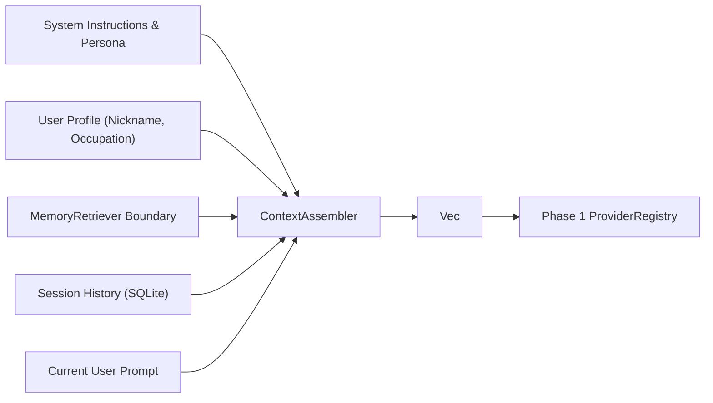
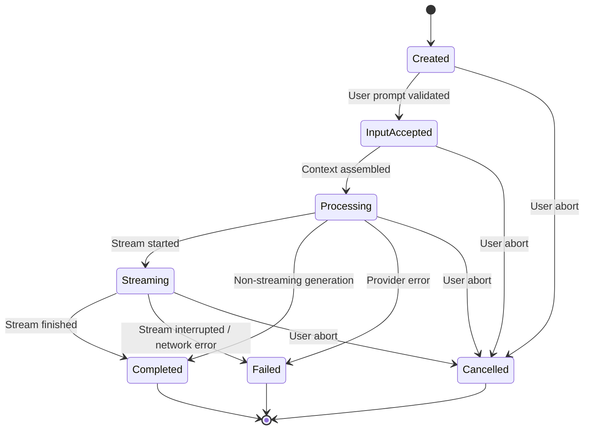
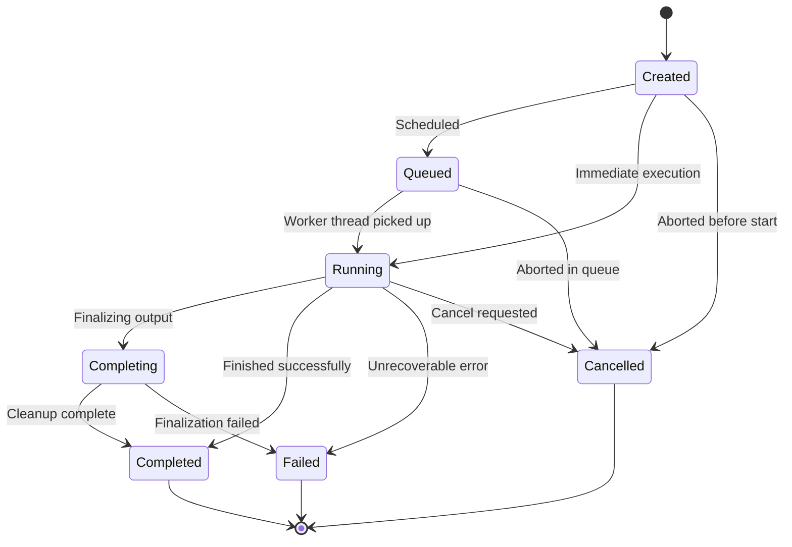

# E.D.I.T.H. Conversation Core & Task Runtime Architecture Specification V1.0

## 1. Purpose

This document specifies the architecture and implementation of **Phase 3** of the unified AI Core ([EDITH-AI-CORE-ARCHITECTURE-V1.1.md](file:///e:/Projects/E.D.I.T.H/docs/architecture/EDITH-AI-CORE-ARCHITECTURE-V1.1.md)).

The primary goal of Phase 3 is to establish the central conversational runtime of E.D.I.T.H. alongside an autonomous asynchronous task execution runtime, without introducing a monolithic "God Object".

Phase 3 implements two closely related but clearly separated runtime domains:
1. **Conversation Core (`src-tauri/src/conversation/`)**: Governs conversational interaction, turn lifecycle, backend-authoritative Turn IDs, message ownership, context assembly, provider/model selection, and streaming coordination.
2. **Task Runtime (`src-tauri/src/task/`)**: Governs asynchronous, long-running, multi-step execution lifecycles, state transitions, task progress, cancellation tokens, and concurrent task isolation.

Both domains communicate through typed contracts and integrate with the Phase 1 `ProviderRegistry` and Phase 2 `EventEmitter` correlated event infrastructure.

---

## 2. Current Conversation Architecture

Prior to Phase 3:
- The chat flow was centered around a monolithic `chat_command` in `src-tauri/src/chat.rs`.
- The frontend `ChatView.tsx` generated client-side pseudo-identifiers (`user-Date.now()`, `assistant-Date.now()`), treated itself as the primary authority for message creation, and directly wrote user/assistant messages to SQLite via `save_session_message`.
- Turns lacked an explicit lifecycle or state machine; generation was either in-flight or completed with no formal tracking of intermediate transitions (`InputAccepted`, `Processing`, `Streaming`, `Completed`, `Failed`, `Cancelled`).
- Scoped turn cancellation did not exist; there was no mechanism to abort an in-flight LLM stream for a specific turn while preserving other operations.
- Long-running autonomous workflows (such as `browser_agent` and `browser_orchestrator`) managed ad-hoc cancellation maps (`Mutex<HashMap<String, Arc<AtomicBool>>>`) without a unified task model.

---

## 3. Session vs Conversation vs Turn vs Message

Phase 3 enforces a strict structural distinction among the core conversational abstractions:



### Definitions:
1. **Session**: Represents the top-level user interaction scope, mission workspace, or session thread. Mapped to SQLite `sessions (id, title, timestamp)`.
2. **Conversation**: Represents a persistent or logical dialogue thread under a session. In the current database schema, a session maps 1:1 with a primary conversation thread, but the models decouple conversation identity from session storage.
3. **Turn**: Represents a single user prompt and its associated assistant processing, tool invocation, and streaming response lifecycle. Identified by a backend-authoritative `TurnId`.
   - **Backend-Authoritative TurnId**: The backend is ALWAYS the sole authoritative creator and owner of `TurnId`. Any client-provided `client_turn_id` is treated strictly as a non-authoritative legacy correlation hint for backward compatibility; it is never stored as `TurnId`, never emitted as `TurnId`, and never used for turn lookup.
   - **Authoritative StreamId Ownership**: Each `Turn` establishes and owns its authoritative `StreamId`. `execute_turn` and `cancel_turn` retrieve the stream identity directly from the `Turn` state, preventing execution and cancellation correlation divergence.
4. **Message**: Represents individual persisted or displayable chat items (`user`, `assistant`, `system`, `tool`) with sequence and timestamps.

---

## 4. Conversation Core Responsibilities

### In Scope:
- Conversation and session lifecycle coordination.
- Backend-authoritative Turn creation and `TurnId` generation (strictly ignoring any client attempts to impose an authoritative turn identity).
- Authoritative `StreamId` creation and binding to `Turn` state.
- Turn lifecycle state machine transitions (`Created` $\to$ `InputAccepted` $\to$ `Processing` $\to$ `Streaming` $\to$ `Completed` / `Failed` / `Cancelled`).
- Context assembly: aggregating system instructions, user profile metadata, retrieved knowledge, and chat history.
- Dynamic provider and model resolution via Phase 1 `ProviderRegistry`.
- Streaming integration via Phase 2 `EventEmitter`.
- Scoped turn cancellation via per-turn atomic cancellation tokens, guaranteeing exactly one terminal lifecycle event (`StreamCancelled`, `StreamFinished`, or `StreamFailed`).
- Normalized conversation errors (`ConversationError`).
- Message persistence in SQLite.

### Out of Scope:
- Provider internal adapter logic (owned by `src-tauri/src/ai/`).
- Browser automation driver (owned by `src-tauri/src/browser*`).
- Tool execution, policy, and sandboxing (reserved for Phase 4 Universal Tool Runtime).
- Audio hardware transport and STT/TTS synthesis.

---

## 5. Task Runtime Responsibilities

The `TaskRuntime` (`src-tauri/src/task/`) acts as a general-purpose, asynchronous execution infrastructure completely decoupled from conversation:

### In Scope:
- Task registration and identity allocation (`TaskId`).
- Typed lifecycle state machine:
  $$\text{Created} \longrightarrow \text{Queued} \longrightarrow \text{Running} \longrightarrow \begin{cases} \text{Completing} \longrightarrow \text{Completed} \\ \text{Failed} \\ \text{Cancelled} \end{cases}$$
- Dynamic step progress tracking (`step`, `max_steps`, `status_text`).
- Atomic cooperative cancellation via `CancellationToken`.
- Correlated event emission via Phase 2 `EventEmitter` (`TaskPayload::Started`, `TaskPayload::StepProgress`, `TaskPayload::Finished`, `TaskPayload::Failed`, `TaskPayload::Cancelled`).
- Concurrent task isolation: multiple tasks execute simultaneously without shared mutable state collisions.
- Task query interfaces (`get_task`, `list_active_tasks`, `list_all_tasks`).

### Out of Scope:
- Domain execution logic (e.g. browser DOM manipulation, terminal shell commands). The Task Runtime is infrastructure, not an agent executor.

---

## 6. State Ownership

| Domain | Authoritative Owner | In-Memory Representation | Persistence Strategy |
| :--- | :--- | :--- | :--- |
| **Conversations & Messages** | Rust Backend (`ConversationCore`) | `Arc<RwLock<HashMap<TurnId, Arc<RwLock<Turn>>>>>` | SQLite Database (`sessions`, `messages`) |
| **Turn Lifecycle** | Rust Backend (`ConversationCore`) | In-memory `Turn` struct with `CancellationToken` | Volatile per turn lifecycle |
| **Tasks & Subtasks** | Rust Backend (`TaskRuntime`) | `Arc<RwLock<HashMap<TaskId, Arc<RwLock<TaskHandle>>>>>` | In-memory runtime registry |
| **UI Presentation State** | React Frontend (`ChatView`) | React local state / derived UI state | Ephemeral / Client memory |
| **Model & Credential State** | Rust Backend (`ProviderRegistry`) | `CredentialStore` + SQLite settings table | Encrypted OS Store / SQLite settings |

---

## 7. Context Assembly Boundary

Context assembly is isolated behind the `ContextAssembler` and `MemoryRetriever` boundary in `src-tauri/src/conversation/context.rs`:



The `MemoryRetriever` trait provides asynchronous semantic retrieval without hardcoding LanceDB vector queries inside Conversation Core.

---

## 8. Provider Integration

Conversation Core interfaces with AI providers strictly through the Phase 1 `ProviderRegistry`:

```
ConversationCore
      │
      ▼
ProviderRegistry::resolve_provider(provider_id)
      │
      ▼
Arc<dyn Provider>
      ├── as_streaming_text() ──► StreamingTextCapability::stream(...)
      └── as_text_generation() ──► TextGenerationCapability::generate(...)
```

Conversation Core contains no provider-specific API endpoints, HTTP header logic, or raw API key handling.

---

## 9. Correlated Event Integration

All streaming chunks and task updates emit through Phase 2 `EventEmitter` using strict correlation envelopes:

- **Stream Events**: Carry `conversation_id`, `turn_id`, and `stream_id`. Monotonically sequenced chunks prevent token collisions.
- **Task Events**: Carry `task_id` and optional parent `turn_id` / `conversation_id` correlations.

---

## 10. Turn State Machine



Invalid transitions (e.g., `Completed` $\to$ `Streaming` or `Failed` $\to$ `InputAccepted`) are deterministically rejected.

---

## 11. Task State Machine



---

## 12. Cancellation Model
 
Cancellation is scoped and isolated at both the Turn and Task levels:
1. **Turn Cancellation**: `conversation_cancel_turn(turn_id, reason)` signals that specific turn's `CancellationToken`. The active stream listener breaks, emits `StreamPayload::Cancelled`, and marks the turn status as `TurnStatus::Cancelled`.
   - **Single Terminal Event Guarantee**: A stream transitions to exactly one terminal state (`StreamCancelled`, `StreamFinished`, or `StreamFailed`). Once a turn is cancelled, `execute_turn()` verifies the state transition and suppresses duplicate `StreamCancelled` emissions. No `StreamFinished` or `StreamFailed` event is emitted after cancellation.
   - **Isolation**: Cancelling Turn A trips only Turn A's token; Turn B and any concurrent tasks continue without interference.
2. **Task Cancellation**: `task_cancel(task_id, reason)` signals that specific task's `CancellationToken`, sets status to `Cancelled`, and emits `TaskPayload::Cancelled`. Other concurrent tasks remain unaffected.

---

## 13. Persistence Integration

Conversation persistence remains 100% backward compatible with SQLite:
- `sessions`: `(id, title, timestamp)`
- `messages`: `(id, session_id, role, text, time)`

When `ConversationCore` submits a turn, it records the user message. When the turn concludes (or is cancelled), it records the assistant response.

---

## 14. Memory Integration Boundary

Conversation Core defines the `MemoryRetriever` trait:
```rust
pub trait MemoryRetriever: Send + Sync {
    fn retrieve_context<'a>(
        &'a self,
        query: &'a str,
    ) -> Pin<Box<dyn Future<Output = Vec<String>> + Send + 'a>>;
}
```
This boundary allows semantic memory lookups without embedding LanceDB queries or schema assumptions into the conversation domain.

---

## 15. IPC Boundary

Exposed Tauri IPC commands:
- `conversation_submit_turn(sessionId, message, providerId, modelId, temperature, clientTurnId)`
- `conversation_execute_turn(turnId, streamId?, appSettings)`
- `conversation_cancel_turn(turnId, reason)`
- `conversation_get_turn_status(turnId)`
- `task_create(taskType, goal, sessionId, turnId)`
- `task_cancel(taskId, reason)`
- `task_get_status(taskId)`
- `task_list_active()`

---

## 16. Frontend Migration

The frontend migration is executed incrementally:
- `src/services/conversationService.ts` provides typed wrappers for all conversation and task commands.
- `src/views/ChatView.tsx` uses `submitConversationTurn` to obtain backend-authoritative Turn IDs, binding its streaming subscription to `streamRouter.subscribeTurn(turnId)`.
- Existing UI layouts, Tactical HUD status, and Arc Reactor animations remain unchanged.

---

## 17. Concurrency Model

- **Turns**: Sequential within a single conversation session; concurrent across distinct sessions.
- **Tasks**: Fully concurrent. `TaskRuntime` maintains independent cancellation tokens, locks, and progress trackers per `TaskId`.

---

## 18. Testing Strategy

1. **Unit Tests (`src-tauri/src/conversation/tests.rs`)**:
   - Turn creation & backend-authoritative Turn IDs.
   - Lifecycle state machine valid transitions & invalid transition rejections.
   - Context assembly with system instructions, user profile, and memory.
   - Provider resolution through `ProviderRegistry`.
   - Streaming event emission with proper correlation.
   - Turn cancellation scoping & concurrent turn isolation.
   - Normalized error taxonomy mapping.
2. **Unit Tests (`src-tauri/src/task/tests.rs`)**:
   - Task creation, identity uniqueness, and snapshot generation.
   - Task lifecycle transitions and rejection of illegal terminal transitions.
   - Step progress tracking and correlated event emission.
   - Task cancellation tokens.
   - Concurrent task isolation (Task A cancelled, Task B completed, Task C failed simultaneously).

---

## 19. Migration Notes for Phase 4

Phase 4 will implement the **Universal Tool Runtime (UTR)**:
- The `Turn` struct will record `tool_calls: Vec<ToolExecution>`.
- The `TaskRuntime` will execute multi-step tool loops using UTR tools.
- `EdithPayload::Tool` events will correlate with active `TurnId` and `TaskId`.

---

## 20. Known Limitations

- Realtime bidirectional audio streaming (Path A S2S) is deferred to Phase 11.
- In-memory tasks do not survive application restarts; persistent task journaling will be considered in future phases if required.
