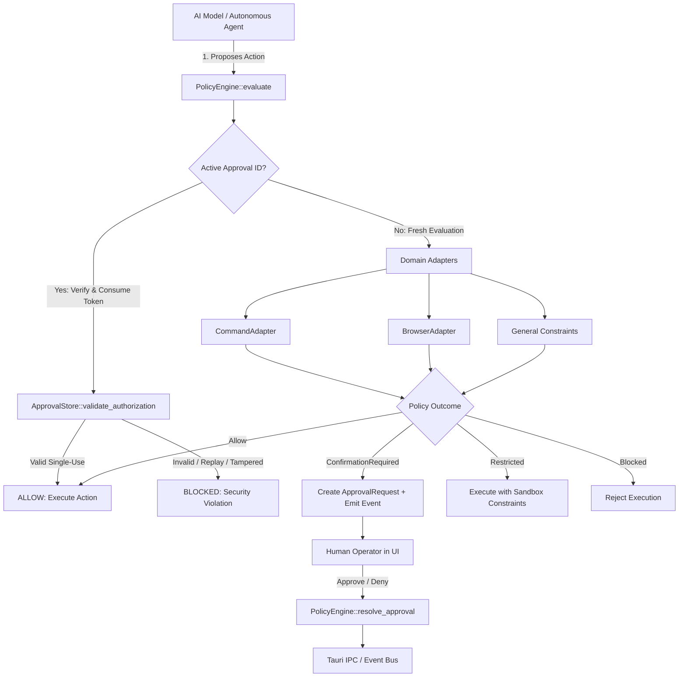

# E.D.I.T.H. Security Policy & Permission Engine Architecture (v1.0)

**Document Version:** 1.0.0  
**Phase:** 4 — Policy / Permission Engine  
**Status:** Implemented & Verified  
**Target Systems:** Tauri 2.0 / Rust Core / TypeScript Frontend  

---

## 1. Executive Summary

In autonomous and AI-assisted desktop platforms, tool and action execution represents the most critical attack surface. A compromise at the tool execution boundary allows prompt injection attacks, malicious web content, or hallucinations to execute destructive operating system commands, exfiltrate sensitive files, or trigger unauthorized financial or administrative transactions.

The **E.D.I.T.H. Policy & Permission Engine (Phase 4)** establishes a host-enforced, deterministic, and mandatory security boundary. It evaluates all proposed actions before they can be executed by any component. Under no circumstance is the AI model permitted to decide whether its own requested action is authorized.

---

## 2. Core Security Invariants

1. **Host-Authoritative Final Authority**: The AI model is strictly a requestor. Evaluation occurs exclusively within native Rust code on the host operating system.
2. **Deterministic Fail-Closed Policy**: Any ambiguity, missing context, unrecognized argument structure, unresolvable path, or evaluation failure defaults immediately to `BLOCKED` or `CONFIRMATION_REQUIRED`.
3. **Strict Separation of Risk and Outcome**: Intrinsic risk (the inherent potential danger of an operation, e.g., deleting a file) is strictly separated from the policy outcome (the administrative decision in the current security mode, e.g., allowing or requiring human confirmation).
4. **Cryptographic Anti-Tamper & Anti-Replay Tokens**: Operator approvals are cryptographically bound to the exact canonical SHA-256 digest of the request domain, operation, target, and arguments. An approval token is strictly single-use and cannot be replayed or transferred to modified parameters.
5. **Atomic Policy Invariance**: Pending approvals are bound to the specific `policy_version` under which they were requested. Any dynamic change in policy rules or constraints immediately invalidates unconsumed approvals.
6. **Privacy-Sanitized Audit Trail**: All evaluated proposals and decisions are recorded in an in-memory ring buffer. Sensitive keys (passwords, tokens, cookies, API keys) are recursively redacted prior to logging or IPC transport.

---

## 3. Threat Model & Mitigated Attack Vectors

| Attack Vector | Threat Scenario | Host Mitigation in Phase 4 |
| :--- | :--- | :--- |
| **Prompt Injection / Jailbreak** | Model is tricked by user input or webpage text into issuing `rm -rf /` or `cmd.exe /c powershell ...`. | Host policy rejects direct shell interpreter execution and multi-command chaining operators (`&`, `\|`, `;`). Destructive commands require explicit operator confirmation. |
| **Approval Replay Attack** | Malicious script captures an approval token and attempts to execute the command repeatedly. | Approval status immediately transitions from `Approved` to `Consumed` upon first execution. Replays are blocked. |
| **Parameter Tampering** | Operator approves `rm temp.txt`; model or attacker modifies the payload to `rm /system32` with the same approval ID. | `ApprovalRequest` validates SHA-256 hash of incoming arguments against the stored digest. Mismatch triggers immediate rejection. |
| **Workspace / Directory Traversal** | Model attempts relative path jumps (`../../Windows/System32`) or symbolic link escapes. | Target paths are canonicalized and verified against designated `workspace_roots` using strict component-wise prefix checks (`PathSandbox`). |
| **Browser Scheme Abuse** | Model or malicious DOM navigates to `javascript:alert(1)`, `file:///C:/...`, or native OS handlers (`mailto:`, `tel:`). | Unsafe URI schemes are flagged as `Critical` risk and unconditionally `BLOCKED`. |
| **Credential / Token Exfiltration** | Model logs or transmits sensitive passwords, API keys, or JWT tokens in logs or event streams. | All arguments pass through `sanitize_value`, replacing matching credential keys with `"[REDACTED]"`. |

---

## 4. Architectural Domain Decomposition



The Policy Engine sits between intention (Conversation Core / Agents) and execution (Future Universal Tool Runtime in Phase 5). It does not know how to run tools; it solely knows whether tools *may* run.

---

## 5. Request & Context Architecture

### 5.1 `ActionRequest`
Represents the normalized payload submitted for authorization:
```rust
pub struct ActionRequest {
    pub domain: String,             // "system", "browser", "filesystem"
    pub operation: String,          // "execute_command", "navigate", "type"
    pub target: ActionTarget,       // Strongly-typed enum
    pub arguments: serde_json::Value,
}
```

### 5.2 `ActionTarget`
Categorizes the target entity to allow targeted containment rules:
- `Command { program: String, args: Vec<String> }`
- `Path { path: PathBuf, is_write: bool }`
- `Url(String)`
- `BrowserElement { selector: String, tag: Option<String>, role: Option<String>, text: Option<String> }`
- `SystemTarget(String)`
- `None`

### 5.3 `PolicyContext`
Supplies correlated metadata required for security decisions:
```rust
pub struct PolicyContext {
    pub session_id: Option<String>,
    pub turn_id: Option<String>,
    pub task_id: Option<String>,
    pub source: ActionSource,        // AutonomousAgent, UserTurn, BackgroundTask
    pub security_mode: SecurityMode, // Autonomous, Standard, Restricted
    pub workspace_roots: Vec<PathBuf>,
    pub active_approval_id: Option<String>,
}
```

---

## 6. Intrinsic Risk vs. Policy Outcome

Intrinsic risk describes what *could* happen. Policy outcome determines what *will* happen.

### Risk Levels
- **Safe**: Read-only, passive observation (e.g., `browser_screenshot`, `browser_get_tabs`).
- **Low**: Non-destructive, localized queries (e.g., `whoami /user`, `ping 8.8.8.8`).
- **Medium**: Standard filesystem reads or non-sensitive text entry.
- **High**: Destructive filesystem changes, external process termination, financial UI actions.
- **Critical**: Direct shell invocation, script injection URI schemes (`javascript:`), password inputs.

### Outcome Matrix
| Operational Mode | Safe / Low Risk | Medium Risk | High Risk | Critical Risk |
| :--- | :--- | :--- | :--- | :--- |
| **Autonomous** | `ALLOW` | `ALLOW` | `CONFIRMATION_REQUIRED` | `BLOCKED` (or `CONFIRMATION_REQUIRED` for passwords) |
| **Standard** | `ALLOW` | `CONFIRMATION_REQUIRED` | `CONFIRMATION_REQUIRED` | `BLOCKED` |
| **Restricted** | `CONFIRMATION_REQUIRED` | `CONFIRMATION_REQUIRED` | `BLOCKED` | `BLOCKED` |

---

## 7. Human-In-The-Loop Approval Store

Pending approvals are stored host-side in `ApprovalStore`:
- **Cryptographic Request Hash**: `SHA-256(domain | operation | target | arguments)`
- **Time-to-Live (TTL)**: 300 seconds default. Expired approvals are automatically rejected.
- **Strict Single-Use**: Consumed immediately upon execution. A consumed token cannot authorize another run.
- **Policy Version Invalidation**: Incrementing the engine's `policy_version` causes all existing unconsumed approvals to fail authorization validation.

---

## 8. Domain Adapters

### 8.1 `CommandAdapter`
- Evaluates program identity, argument lists, and shell chaining.
- Rejects shell binary invocations (`cmd`, `powershell`, `bash`, `sh`).
- Rejects shell metacharacters (`&`, `|`, `;`, `>`, `<`, etc.).
- Verifies working directory against `ctx.workspace_roots`.

### 8.2 `BrowserAdapter`
- Enforces URL scheme restrictions (`javascript:`, `file:`, `data:text/html` are blocked).
- Inspects selectors and attributes for sensitive fields (password, credit cards, CVV).
- Detects high-risk CTA buttons ("Buy Now", "Confirm Payment", "Delete Account").

---

## 9. Observability & Correlated Events

The Policy Engine integrates directly with Phase 2's `EventEmitter` via `SecurityPolicyPayload`:
1. `policy_evaluated`: Emitted on every evaluation with `risk_level`, `outcome`, `reason`, and optional `approval_id`.
2. `approval_requested`: Emitted when human confirmation is required.
3. `approval_resolved`: Emitted when an operator approves or denies a pending request.

---

## 10. Verification Matrix

The test suite in `src-tauri/src/policy/tests.rs` validates all core invariants:
1. `test_safe_diagnostics_allowed_in_standard_mode`
2. `test_shell_interpreter_invocation_strictly_blocked`
3. `test_shell_operator_chaining_strictly_blocked`
4. `test_destructive_command_requires_confirmation`
5. `test_browser_unsafe_javascript_scheme_blocked`
6. `test_browser_file_scheme_blocked`
7. `test_browser_safe_navigation_allowed`
8. `test_browser_passive_observation_allowed`
9. `test_browser_password_input_requires_confirmation`
10. `test_browser_financial_button_requires_confirmation`
11. `test_approval_lifecycle_and_single_use_consumption`
12. `test_tampered_arguments_rejected_despite_valid_approval_id`
13. `test_denied_approval_cannot_authorize_action`
14. `test_policy_update_invalidates_prior_approvals`
15. `test_audit_trail_redacts_sensitive_credentials`
16. `test_event_emitter_correlated_lifecycle`

---

## 11. Migration Path to Phase 5

With Phase 4 complete, the host has a hardened, tamper-proof security decision engine. Phase 5 (Universal Tool Runtime) will invoke `PolicyEngine::evaluate` as the mandatory first step before routing or executing any tool call.
