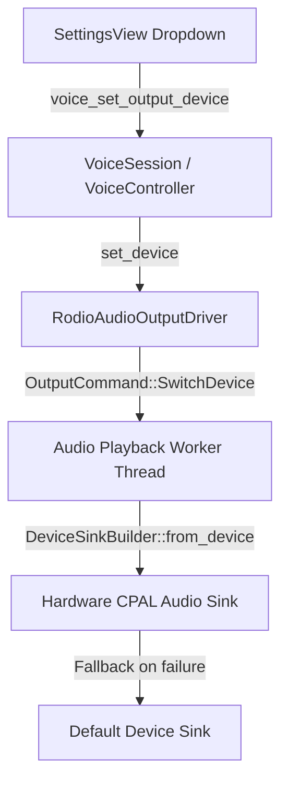

# E.D.I.T.H. Voice UX & Production Reliability Architecture (V1.0)
## Phase 11 — Realtime Duplex Speech-to-Speech Production Hardening

---

### 1. Executive Summary

Phase 11 finalizes the voice capabilities of the E.D.I.T.H. AI assistant by hardening the Phase 10 Realtime Duplex Speech-to-Speech (S2S) infrastructure into a production-grade desktop experience. It introduces:
1. **Orthogonal Full-Duplex State Composition**: Replaces single mutually-exclusive state flags with independent input, output, session, and processing state vectors that accurately represent full-duplex conversations.
2. **Signal-Driven Arc Reactor Visualizer**: Completely eliminates simulated random audio fluctuations in favor of high-fidelity frequency band energy (RMS, peak, and 8 pseudo-spectral bands in basis points 0..10000).
3. **Dynamic Audio Device Switching**: Native hardware device enumeration and selection with restart-free hot-swapping for both microphones and speakers via CPAL and Rodio.
4. **Deterministic Barge-In Correctness**: Invariant-driven barge-in guarantees featuring monotonic generation IDs, stale-packet rejection, and immediate hardware playback termination.
5. **Acoustic Pre-processing & Echo Mitigation**: Software ducking echo cancellation elevating the barge-in speech threshold during active playback to suppress speaker loopback while remaining responsive to intentional user speech.
6. **Privacy-Safe Telemetry**: Redaction of raw hardware device strings in favor of truncated SHA-256 opaque device IDs.

---

### 2. Orthogonal Duplex State Machine

In traditional single-state machines, states like `Listening` and `Speaking` are mutually exclusive. In full-duplex conversational AI, however, the user may speak while the assistant is speaking (barge-in / interruption). 

E.D.I.T.H. models this via four orthogonal state vectors:

```
┌────────────────────────────────────────────────────────────────────────┐
│                          DuplexVoiceState                              │
├────────────────────────────────────────────────────────────────────────┤
│ session:    Disabled | Idle | Connecting | Connected | Reconnecting   │
│             | Fallback | Error                                         │
├────────────────────────────────────────────────────────────────────────┤
│ input:      Inactive | ListeningAmbient | UserSpeaking | Muted         │
├────────────────────────────────────────────────────────────────────────┤
│ output:     Silent | AssistantSpeaking | InterruptedDucking            │
├────────────────────────────────────────────────────────────────────────┤
│ processing: Idle | ModelInferring | ModelStreaming | ToolExecuting     │
├────────────────────────────────────────────────────────────────────────┤
│ active_turn_id: Option<String>        generation_id: u64               │
└────────────────────────────────────────────────────────────────────────┘
```

#### Invariants:
- **Barge-in Predicate**: `can_barge_in() = (output == AssistantSpeaking || output == InterruptedDucking) && (input == UserSpeaking)`.
- **Authoritative Turn Ownership**: `active_turn_id` is assigned and finalized strictly by `ConversationCore`.

---

### 3. Audio Device Subsystem & Restart-Free Sink Switching

The `AudioDeviceManager` monitors host audio endpoints via CPAL and dynamically routes playback streams:



- **Clean Handover**: When changing playback sinks, active playback handles are cleanly stopped, and `DeviceSinkBuilder::from_device(d).and_then(|b| b.open_sink_or_fallback())` initializes the new physical device without interrupting application execution or restarting the Tauri host.
- **Missing Device Fallback**: Disconnection or disappearance of a selected device automatically falls back to system defaults without panics.

---

### 4. Acoustic DSP & Echo Cancellation Boundary

The audio signal flow passes through conditioning stages prior to network transmission:

```
Microphone Audio (PCM)
       │
       ▼
┌───────────────────────────┐
│     AudioNormalizer       │  ◄── Single-pole 80Hz High-Pass Filter (DC Rumble Removal)
└──────────────┬────────────┘      Soft Peak Limiting (Dynamic Range Protection)
               │
               ▼
┌───────────────────────────┐
│       EnergyVad           │  ◄── Energy + Zero Crossing Rate (ZCR) Speech Probability
└──────────────┬────────────┘      Hangover Decay Grace Period
               │
               ▼
┌───────────────────────────┐
│ SoftwareDuckingEchoCanc   │  ◄── Multiplies VAD Energy Threshold by 2.2x during Playback
└──────────────┬────────────┘      Prevents Assistant Acoustic Self-Triggering
               │
               ▼
Outbound Realtime Audio Frame
```

#### Continuous Stream Invariant:
Silence frames detected by `EnergyVad` are **never dropped** or suppressed from continuous transport streams. They are preserved intact so provider-side server VAD and acoustic models maintain uninterrupted streaming context.

---

### 5. Signal-Driven Arc Reactor Visualizer

The UI visualizer consumes `VoicePayload::VisualizerEnergy`:
- `rms: u32`: Root-mean-square amplitude in basis points ($0 \dots 10000$).
- `peak: u32`: Peak absolute sample amplitude in basis points ($0 \dots 10000$).
- `bands: [u32; 8]`: Sub-band frequency energy distribution.
- `direction: "input" | "output"`: Direction of speech energy.

When audio energy ceases, a 60ms decay timer smoothly decreases visualizer bar height ($I_{t+1} = I_t \times 0.88$) to resting idle levels ($15\%$), creating an organic, responsive pulsation without jarring cutoffs or pseudo-random animations.

---

### 6. Privacy-Safe Telemetry & Observability

To protect user privacy across diagnostics and error reports:
- Hardware device names (e.g., `"Realtek High Definition Audio (Mic 1)"`) are strictly quarantined to UI menus.
- Telemetry, session logs, and IPC status packets use truncated SHA-256 opaque IDs:
  $$\text{id} = \text{"in\_"} + \text{hex}(\text{SHA256}(\text{"in:"} + \text{name})[0\dots 8])$$
  $$\text{id} = \text{"out\_"} + \text{hex}(\text{SHA256}(\text{"out:"} + \text{name})[0\dots 8])$$
- Automated tests verify that no raw device strings appear in serialized telemetry reports.

---

### 7. Verification Matrix

| Test Identifier | Category | Verification Scope | Status |
|---|---|---|---|
| `test_orthogonal_duplex_state_transitions` | State Machine | Full-duplex concurrency (user & assistant speaking) | **PASSED** |
| `test_audio_device_enumeration` | Device Manager | Physical device listing and opaque ID derivation | **PASSED** |
| `test_clean_output_device_handover` | Audio Output | Live sink handover and device naming | **PASSED** |
| `test_device_disappearance_and_default_fallback` | Recovery | Nonexistent device resolution fallback | **PASSED** |
| `test_reconnect_exponential_backoff_and_exhaustion` | Recovery | 3-attempt bounded backoff and exhaustion | **PASSED** |
| `test_deterministic_barge_in_invariants` | Barge-in | Generation ID invalidation & stale frame drop | **PASSED** |
| `test_continuous_audio_streaming_preserves_silence` | DSP / VAD | Silence frame preservation in transport | **PASSED** |
| `test_dsp_echo_ducking_threshold` | DSP / AEC | Threshold elevation during active playback | **PASSED** |
| `test_telemetry_redaction_uses_opaque_device_ids` | Telemetry | Device name redaction in JSON payload | **PASSED** |
| `test_soak_multiturn_voice_session` | Integration | 5-turn duplex exchange with mid-turn barge-in | **PASSED** |
| `test_01` – `test_10` (Phase 10 Suite) | Phase 10 | Realtime transport, UTR tools, turn ownership | **PASSED** |
| `test_01` – `test_10` (Phase 9 Suite) | Phase 9 | Fallback STT/TTS pipeline contracts | **PASSED** |

**Total Test Suite Execution**: 30 passed; 0 failed; 0 warnings.
